# Sistema de Conciliação Financeira

[](https://dotnet.microsoft.com/)
[](LICENSE)

Sistema de reconciliação automatizada de transações financeiras, construído com Domain-Driven Design (DDD) e .NET 10.

## 📋 Índice

- [Visão Geral](#-visão-geral)
- [Arquitetura](#-arquitetura)
- [Modelo de Domínio](#-modelo-de-domínio)
- [Camada de Aplicação](#-camada-de-aplicação)
- [Políticas e Regras](#-políticas-e-regras)
- [Fluxo de Reconciliação](#-fluxo-de-reconciliação)
- [Estrutura do Projeto](#-estrutura-do-projeto)
- [Quick Start](#-quick-start)
- [Decisões de Design](#-decisões-de-design)
- [Extensibilidade](#-extensibilidade)
- [Roadmap](#-roadmap)
- [Licença](#-licença)

## 🎯 Visão Geral

O Sistema de Conciliação Financeira automatiza a reconciliação entre transações internas (ERP/Core) e lançamentos externos (bancos, gateways, APIs). Oferece **dois pontos de entrada**: um serviço de domínio que retorna itens de conciliação individuais e um serviço de aplicação que retorna resultados em lote com listas tipadas (Matched, Divergent, Missing, Extra).

### Principais Funcionalidades

- ✅ **Duas APIs de reconciliação**: Domain (`SimpleReconciliationService`) e Application (`ReconciliationAppService`)
- ✅ **Resultado em lote**: `ReconciliationBatchResult` com listas separadas para Matched, Divergent, Missing e Extra
- ✅ **Políticas composáveis**: regras atômicas (`IReconciliationRule`) combinadas via `CompositeReconciliationPolicy`
- ✅ **Regras reutilizáveis**: ReferenceMatchRule, DateMatchRule, AmountToleranceRule
- ✅ **Comparação monetária** com tolerância (Value Object `Money`)
- ✅ **Testes** para Domain, Application e Rules

## 🏗️ Arquitetura

### Visão de Contexto (C4 - Level 1)

```
┌─────────────────────────────────────────────────────────────────────────┐
│                      SISTEMA DE CONCILIAÇÃO                             │
├─────────────────────────────────────────────────────────────────────────┤
│                                                                         │
│    ┌──────────┐         ┌──────────────────┐         ┌───────────┐       │
│    │ Sistema  │         │                  │         │  Bancos   │       │
│    │ Interno  │────────▶│  Reconciliation  │◀────────│  ERPs     │       │
│    │(ERP/Core)│         │     Engine       │         │  Gateways │       │
│    └──────────┘         └──────────────────┘         └───────────┘       │
│          │                       │                         │             │
│          ▼                       ▼                         ▼             │
│    ┌──────────┐         ┌──────────────────┐     ┌──────────────┐       │
│    │Transactions│        │BatchResult /     │     │ExternalEntries│      │
│    └──────────┘         │ReconciliationItem│     └──────────────┘       │
│                         │ Matched|Divergent|Missing|Extra                 │
│                         └──────────────────┘                             │
└─────────────────────────────────────────────────────────────────────────┘
```

### Arquitetura em Camadas

```
┌─────────────────────────────────────────────────────────────────────────┐
│                    API Layer (ASP.NET Core)                             │
│                    Controllers, OpenAPI                                 │
├─────────────────────────────────────────────────────────────────────────┤
│                    Application Layer                                     │
│  ┌─────────────────────────────┐  ┌─────────────────────────────────┐   │
│  │ ReconciliationAppService    │  │ ReconciliationBatchResult       │   │
│  │ • Reconcile(tx, ext)        │  │ • Matched, Divergent            │   │
│  │ • ReconcileBatch(txs, exts) │  │ • Missing, Extra                 │   │
│  └─────────────────────────────┘  └─────────────────────────────────┘   │
├─────────────────────────────────────────────────────────────────────────┤
│                         Domain Layer                                     │
│  ┌─────────────┐  ┌─────────────┐  ┌─────────────────────────────────┐  │
│  │  Entities   │  │   Value     │  │ SimpleReconciliationService      │  │
│  │ Transaction │  │   Objects   │  │ • Reconcile() → ReconciliationItem[]│
│  │ ExternalEntry│  │   Money     │  └─────────────────────────────────┘  │
│  │ReconciliationItem│           │                                        │
│  └─────────────┘  └─────────────┘  ┌─────────────────────────────────┐  │
│                                    │ Policies                          │  │
│  ┌─────────────────────────────────▼─────────────────────────────────┐  │
│  │ IReconciliationPolicy          IReconciliationRule                │  │
│  │   • IsMatch(tx, ext)             • IsSatisfied(tx, ext)           │  │
│  │   DefaultReconciliationPolicy    ReferenceMatchRule               │  │
│  │   CompositeReconciliationPolicy  DateMatchRule                    │  │
│  │                                   AmountToleranceRule             │  │
│  └───────────────────────────────────────────────────────────────────┘  │
├─────────────────────────────────────────────────────────────────────────┤
│                   Infrastructure Layer                                   │
│                        [Em desenvolvimento]                              │
└─────────────────────────────────────────────────────────────────────────┘
```

## 📊 Modelo de Domínio

```mermaid
classDiagram
    class Transaction {
        +int Id
        +decimal Amount
        +DateTime Date
        +string Reference
    }
    
    class ExternalEntry {
        +int Id
        +decimal Amount
        +DateTime Date
        +string Reference
        +string Source
    }
    
    class Money {
        +decimal Amount
        +Equals(Money, tolerance) bool
    }
    
    class ReconciliationItem {
        +Transaction? Transaction
        +ExternalEntry? ExternalEntry
        +ReconciliationResult Result
    }
    
    class ReconciliationResult {
        <<enumeration>>
        Matched
        Divergent
        Missing
        Extra
    }
    
    class IReconciliationPolicy {
        <<interface>>
        +IsMatch(Transaction, ExternalEntry) bool
    }
    
    class IReconciliationRule {
        <<interface>>
        +IsSatisfied(Transaction, ExternalEntry) bool
    }
    
    class DefaultReconciliationPolicy {
        -decimal tolerance
    }
    
    class CompositeReconciliationPolicy {
        -IEnumerable~IReconciliationRule~ rules
    }
    
    class ReferenceMatchRule
    class DateMatchRule
    class AmountToleranceRule
    
    class SimpleReconciliationService {
        +Reconcile(transactions, entries) IReadOnlyCollection~ReconciliationItem~
    }
    
    class ReconciliationAppService {
        +Reconcile(tx, ext) ReconciliationResult
        +ReconcileBatch(txs, exts) ReconciliationBatchResult
    }
    
    class ReconciliationBatchResult {
        +List~Matched~ Matched
        +List~Divergent~ Divergent
        +List~Transaction~ Missing
        +List~ExternalEntry~ Extra
    }
    
    SimpleReconciliationService --> IReconciliationPolicy
    ReconciliationAppService --> IReconciliationPolicy
    DefaultReconciliationPolicy ..|> IReconciliationPolicy
    CompositeReconciliationPolicy ..|> IReconciliationPolicy
    CompositeReconciliationPolicy --> IReconciliationRule : compõe
    ReferenceMatchRule ..|> IReconciliationRule
    DateMatchRule ..|> IReconciliationRule
    AmountToleranceRule ..|> IReconciliationRule
    AmountToleranceRule --> Money
```



## 📦 Camada de Aplicação

A camada de aplicação expõe o **ReconciliationAppService**, pensado para orquestração e consumo por API ou UI.

| Método | Descrição | Retorno |
|--------|-----------|---------|
| `Reconcile(Transaction, ExternalEntry)` | Concilia um par | `ReconciliationResult` (Matched ou Divergent) |
| `ReconcileBatch(IEnumerable<Transaction>, IEnumerable<ExternalEntry>)` | Concilia lotes | `ReconciliationBatchResult` |

### ReconciliationBatchResult

Agrupa os resultados em listas tipadas, facilitando relatórios e tratamento por tipo:

- **Matched** — pares (Transaction, ExternalEntry) que passaram na política
- **Divergent** — pares com mesma referência mas que não passaram (ex.: valor diferente)
- **Missing** — transações internas sem correspondente externo
- **Extra** — entradas externas sem correspondente interno

O batch usa **indexação por Reference** para encontrar o externo correspondente a cada transação, e marca referências já usadas para classificar Extra ao final.

## 🔧 Políticas e Regras

Existem duas formas de definir quando uma transação e uma entrada externa “batem”:

### 1. Política única: DefaultReconciliationPolicy

Implementação monolítica de `IReconciliationPolicy`: referência igual, mesma data (dia) e valor dentro da tolerância.

```csharp
var policy = new DefaultReconciliationPolicy(tolerance: 0.01m);
```

### 2. Políticas composáveis: IReconciliationRule + CompositeReconciliationPolicy

Regras atômicas implementam `IReconciliationRule`; o **CompositeReconciliationPolicy** exige que **todas** as regras sejam satisfeitas.

| Regra | Descrição |
|-------|-----------|
| **ReferenceMatchRule** | `transaction.Reference == externalEntry.Reference` |
| **DateMatchRule** | Mesmo dia (ignora hora) |
| **AmountToleranceRule** | Valor dentro da tolerância (usa `Money`) |

```csharp
var policy = new CompositeReconciliationPolicy(new IReconciliationRule[]
{
    new ReferenceMatchRule(),
    new DateMatchRule(),
    new AmountToleranceRule(tolerance: 0.01m)
});
```

Tanto `SimpleReconciliationService` quanto `ReconciliationAppService` recebem `IReconciliationPolicy`, então aceitam qualquer uma das duas abordagens.

## 🔄 Fluxo de Reconciliação

### Domain: SimpleReconciliationService

```
Para cada Transaction → busca primeiro ExternalEntry onde Policy.IsMatch(tx, ext)
  → se encontrou: ReconciliationItem(tx, ext, Matched)
  → senão: ReconciliationItem(tx, null, Missing)
Para cada ExternalEntry não usada → ReconciliationItem(null, ext, Extra)
Retorno: IReadOnlyCollection<ReconciliationItem>
```

### Application: ReconciliationAppService.ReconcileBatch

```
Indexar ExternalEntries por Reference
Para cada Transaction:
  se não existe externo com mesma Reference → Missing.Add(transaction)
  senão:
    marcar referência como usada
    se Policy.IsMatch(tx, ext) → Matched.Add((tx, ext))
    senão → Divergent.Add((tx, ext))
Para cada ExternalEntry cuja Reference não foi usada → Extra.Add(ext)
Retorno: ReconciliationBatchResult
```

A diferença principal é que o **AppService** assume correspondência por referência (um externo por referência) e separa **Divergent** (mesma ref, mas sem match na política) de **Missing** (sem ref externa).

## 📁 Estrutura do Projeto

```
Conciliacao/
├── Conciliacao.Api/                    # Web API (ASP.NET Core, OpenAPI)
├── Conciliacao.Application/            # Casos de uso e orquestração
│   ├── Models/
│   │   └── ReconciliationBatchResult.cs
│   └── Services/
│       └── ReconciliationAppService.cs
├── Conciliacao.Domain/                 # Núcleo do domínio
│   ├── Entities/
│   │   ├── Transaction.cs
│   │   ├── ExternalEntry.cs
│   │   └── ReconciliationItem.cs
│   ├── ValueObjects/
│   │   └── Money.cs
│   ├── Enums/
│   │   └── ReconciliationResult.cs
│   ├── Policies/
│   │   ├── IReconciliationPolicy.cs
│   │   ├── IReconciliationRule.cs
│   │   ├── DefaultReconciliationPolicy.cs
│   │   ├── CompositeReconciliationPolicy.cs
│   │   ├── ReferenceMatchRule.cs
│   │   ├── DateMatchRule.cs
│   │   └── AmountToleranceRule.cs
│   └── Services/
│       └── SimpleReconciliationService.cs
├── Conciliacao.Infra/                  # Persistência e integrações
└── Conciliacao.Domain.Tests/           # Testes
    ├── SimpleReconciliationServiceTests.cs
    ├── ReconciliationAppServiceTests.cs
    ├── DefaultReconciliationPolicyTests.cs
    ├── MoneyTests.cs
    └── Policies/
        └── Rules/
            ├── ReferenceMatchRuleTests.cs
            ├── DateMatchRuleTests.cs
            └── AmountToleranceRuleTests.cs
```

## 🚀 Quick Start

### Pré-requisitos

- .NET 10 SDK  
- Git  

### Instalação e Execução

```bash
git clone https://github.com/awernek/Conciliacao.git
cd Conciliacao
dotnet build
dotnet test
dotnet run --project Conciliacao.Api
```

### Exemplo: Domain (itens de conciliação)

```csharp
using Conciliacao.Domain.Policies;
using Conciliacao.Domain.Services;

var policy = new DefaultReconciliationPolicy(tolerance: 0.01m);
var service = new SimpleReconciliationService(policy);
var results = service.Reconcile(transactions, externalEntries);

foreach (var item in results)
    Console.WriteLine($"{item.Result}: {item.Transaction?.Reference} / {item.ExternalEntry?.Reference}");
```

### Exemplo: Application (lote com listas)

```csharp
using Conciliacao.Application.Services;
using Conciliacao.Domain.Policies;

var policy = new CompositeReconciliationPolicy(new IReconciliationRule[]
{
    new ReferenceMatchRule(),
    new DateMatchRule(),
    new AmountToleranceRule(0.01m)
});
var appService = new ReconciliationAppService(policy);
var result = appService.ReconcileBatch(transactions, externalEntries);

Console.WriteLine($"Matched: {result.Matched.Count}, Divergent: {result.Divergent.Count}");
Console.WriteLine($"Missing: {result.Missing.Count}, Extra: {result.Extra.Count}");
```

## 💡 Decisões de Design

| Decisão | Motivação |
|---------|-----------|
| **Dois serviços** (Domain + Application) | Domain retorna itens genéricos; Application retorna DTO em lote (Matched/Divergent/Missing/Extra) para relatórios e APIs. |
| **IReconciliationRule + CompositeReconciliationPolicy** | Regras atômicas e composição permitem combinar critérios sem alterar o core. |
| **ReconciliationBatchResult com listas tipadas** | Facilita consumo por tipo (ex.: só Missing, só Divergent) e relatórios. |
| **Indexação por Reference no batch** | AppService assume uma entrada externa por referência; lookup O(1) por transação. |
| **Divergent explícito** | Diferencia “existe externo com mesma ref, mas não passou na política” de “não existe externo”. |
| **Value Object Money** | Centraliza comparação com tolerância e evita erros de ponto flutuante. |
| **Strategy (IReconciliationPolicy)** | Domain e Application dependem da abstração; Default e Composite são intercambiáveis. |

## 🔧 Extensibilidade

### Nova regra (composite)

```csharp
public class SourceWhitelistRule : IReconciliationRule
{
    private readonly HashSet<string> _allowedSources;
    public SourceWhitelistRule(params string[] sources) 
        => _allowedSources = new HashSet<string>(sources);

    public bool IsSatisfied(Transaction tx, ExternalEntry ext)
        => _allowedSources.Contains(ext.Source);
}

// Uso
var policy = new CompositeReconciliationPolicy(new IReconciliationRule[]
{
    new ReferenceMatchRule(),
    new DateMatchRule(),
    new AmountToleranceRule(0.01m),
    new SourceWhitelistRule("Bank", "Gateway")
});
```

### Política customizada (monolítica)

```csharp
public class StrictPolicy : IReconciliationPolicy
{
    public bool IsMatch(Transaction tx, ExternalEntry ext)
        => tx.Reference == ext.Reference
           && tx.Date.Date == ext.Date.Date
           && tx.Amount == ext.Amount;
}
```

## 🗺️ Roadmap

- [ ] API REST com endpoints de reconciliação (uso do ReconciliationAppService)
- [ ] Persistência com Entity Framework Core
- [ ] Documentação OpenAPI completa
- [ ] Suporte multi-moeda
- [ ] Processamento assíncrono (mensageria)
- [ ] Dashboard e exportação de relatórios

## 📄 Licença

Este projeto está licenciado sob a Licença MIT — veja o arquivo [LICENSE](LICENSE) para detalhes.

## 👤 Autor

**Anderson Wernek**  
- GitHub: [@awernek](https://github.com/awernek)

## 🤝 Contribuindo

Contribuições são bem-vindas. Abra uma issue ou envie um pull request.

1. Fork o projeto  
2. Crie sua branch (`git checkout -b feature/MinhaFeature`)  
3. Commit (`git commit -m 'Add: MinhaFeature'`)  
4. Push (`git push origin feature/MinhaFeature`)  
5. Abra um Pull Request  

---

⭐ Se este projeto foi útil, considere dar uma estrela no repositório.
