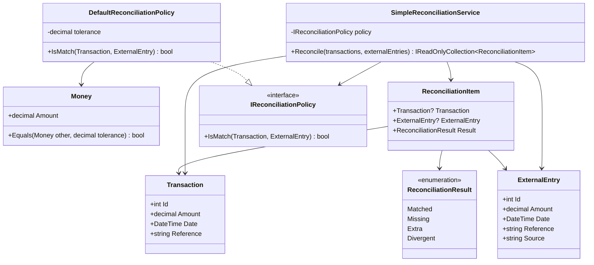
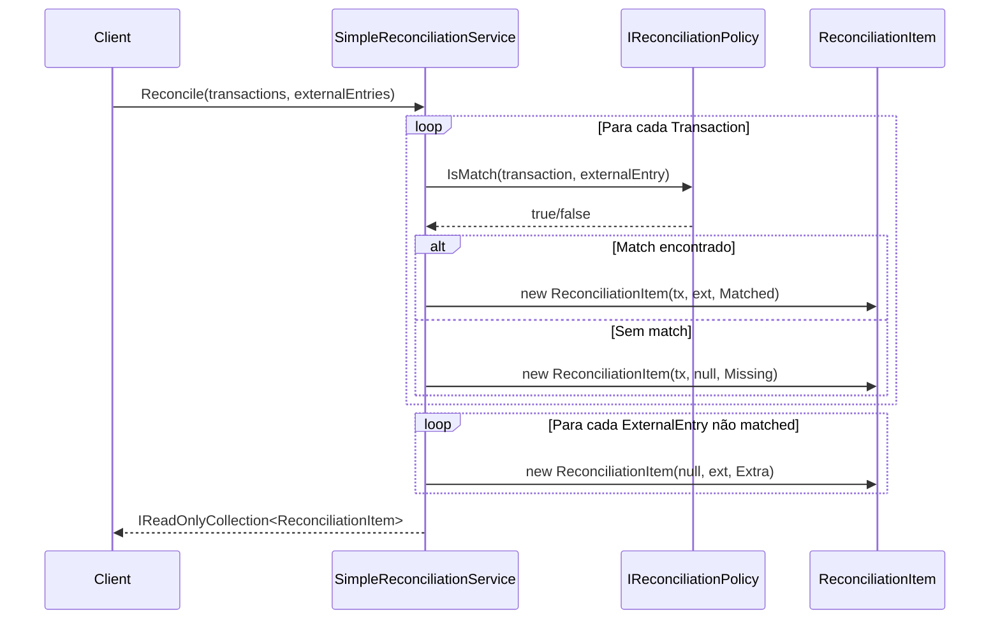
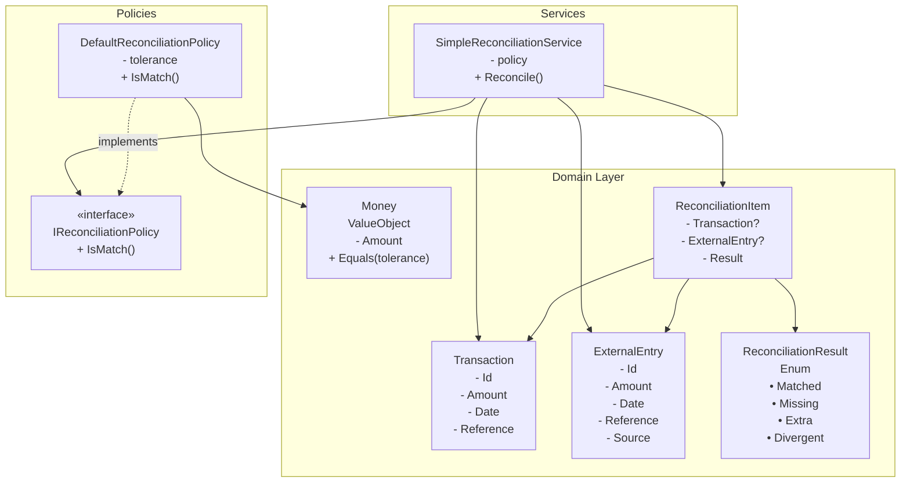

# ?? Sistema de Conciliação Financeira

[](https://dotnet.microsoft.com/)
[](LICENSE)

> Sistema de conciliação automatizada de transações financeiras utilizando arquitetura Domain-Driven Design (DDD) com .NET 10.

## ?? Índice

- [Visão Geral](#-visão-geral)
- [Arquitetura](#-arquitetura)
- [System Design](#-system-design)
- [Componentes Principais](#-componentes-principais)
- [Fluxo de Conciliação](#-fluxo-de-conciliação)
- [Tecnologias](#-tecnologias)
- [Estrutura do Projeto](#-estrutura-do-projeto)
- [Como Usar](#-como-usar)
- [Testes](#-testes)
- [Extensibilidade](#-extensibilidade)

## ?? Visão Geral

O **Sistema de Conciliação** é uma solução robusta para automatizar o processo de reconciliação entre transações internas e entradas de sistemas externos (bancos, gateways de pagamento, ERPs, etc.). O sistema compara registros, identifica correspondências e classifica divergências, facilitando a auditoria e o fechamento contábil.

### Problemas que Resolve

- ? Conciliação manual demorada e propensa a erros
- ? Identificação de transações não registradas (Missing/Extra)
- ? Validação de valores com tolerância configurável
- ? Rastreabilidade através de referências
- ? Flexibilidade para diferentes políticas de matching

## ??? Arquitetura

O projeto segue os princípios de **Domain-Driven Design (DDD)** e **Clean Architecture**, organizando o código em camadas bem definidas:

```
???????????????????????????????????????????????
?         Presentation Layer (API/UI)         ?
?              [Not Implemented]              ?
???????????????????????????????????????????????
                  ?
???????????????????????????????????????????????
?          Application Layer                  ?
?         [Services & Use Cases]              ?
?    • SimpleReconciliationService            ?
???????????????????????????????????????????????
                  ?
???????????????????????????????????????????????
?            Domain Layer                     ?
?         [Business Logic Core]               ?
?  • Entities (Transaction, ExternalEntry)    ?
?  • ValueObjects (Money)                     ?
?  • Policies (IReconciliationPolicy)         ?
?  • Enums (ReconciliationResult)             ?
???????????????????????????????????????????????
                  ?
???????????????????????????????????????????????
?       Infrastructure Layer                  ?
?         [Not Implemented]                   ?
?  • Database Access                          ?
?  • External APIs                            ?
???????????????????????????????????????????????
```

## ?? System Design

### Diagrama de Componentes



### Fluxo de Dados



### Arquitetura de Alto Nível



## ?? Componentes Principais

### 1. **Entities (Entidades)**

#### `Transaction`
Representa uma transação interna do sistema.

**Propriedades:**
- `Id`: Identificador único da transação
- `Amount`: Valor monetário da transação
- `Date`: Data e hora da transação
- `Reference`: Código de referência único

#### `ExternalEntry`
Representa um registro vindo de sistemas externos (bancos, gateways, etc.).

**Propriedades:**
- `Id`: Identificador único da entrada
- `Amount`: Valor monetário
- `Date`: Data e hora do registro
- `Reference`: Código de referência
- `Source`: Origem do registro (ex: "Bank", "PaymentGateway")

#### `ReconciliationItem`
Resultado da conciliação, associando transação e entrada externa.

**Propriedades:**
- `Transaction`: Transação interna (nullable)
- `ExternalEntry`: Entrada externa (nullable)
- `Result`: Status da conciliação

### 2. **Value Objects**

#### `Money`
Encapsula lógica de comparação monetária com tolerância.

**Características:**
- Evita erros de arredondamento em comparações de ponto flutuante
- Suporta tolerância configurável (ex: 0.01 para diferenças de centavos)
- Implementa comparação robusta de valores monetários

**Método Principal:**
```csharp
public bool Equals(Money other, decimal tolerance)
```

### 3. **Enums**

#### `ReconciliationResult`
Define os possíveis resultados de uma conciliação:

- `Matched` - Correspondência perfeita entre transação e entrada externa
- `Missing` - Transação interna sem entrada externa correspondente
- `Extra` - Entrada externa sem transação interna correspondente
- `Divergent` - Reservado para uso futuro (divergências parciais)

### 4. **Policies (Estratégias)**

#### `IReconciliationPolicy`
Interface que define o contrato para estratégias de matching.

**Método:**
```csharp
bool IsMatch(Transaction transaction, ExternalEntry externalEntry);
```

#### `DefaultReconciliationPolicy`
Implementação padrão da política de conciliação.

**Regras de Matching:**
1. **Referência** - Deve ser idêntica
2. **Data** - Deve ser no mesmo dia (ignora hora)
3. **Valor** - Deve estar dentro da tolerância configurável

### 5. **Services**

#### `SimpleReconciliationService`
Orquestra o processo de conciliação usando a política injetada via Dependency Injection.

**Algoritmo:**
```
1. Para cada Transaction:
   a. Buscar ExternalEntry correspondente usando Policy.IsMatch()
   b. Se encontrado: criar ReconciliationItem com status Matched
   c. Se não encontrado: criar ReconciliationItem com status Missing

2. Para cada ExternalEntry não matched:
   a. Criar ReconciliationItem com status Extra
```

## ?? Fluxo de Conciliação

### Cenários de Resultado

| Cenário | Transaction | ExternalEntry | Result | Descrição |
|---------|-------------|---------------|--------|-----------|
| ? Sucesso | ? | ? | `Matched` | Correspondência perfeita encontrada |
| ?? Falta | ? | ? | `Missing` | Transação sem comprovante externo |
| ?? Sobra | ? | ? | `Extra` | Entrada externa sem transação interna |

### Exemplo Prático

```csharp
using Conciliacao.Domain.Services;
using Conciliacao.Domain.Policies;
using Conciliacao.Domain.Entities;

// Configurar política com tolerância de 1 centavo
var policy = new DefaultReconciliationPolicy(tolerance: 0.01m);
var service = new SimpleReconciliationService(policy);

// Dados de entrada
var transactions = new[]
{
    new Transaction { Id = 1, Amount = 100.00m, Date = DateTime.Today, Reference = "REF001" },
    new Transaction { Id = 2, Amount = 250.00m, Date = DateTime.Today, Reference = "REF002" }
};

var externalEntries = new[]
{
    new ExternalEntry 
    { 
        Id = 1, 
        Amount = 100.00m, 
        Date = DateTime.Today, 
        Reference = "REF001", 
        Source = "Bank" 
    },
    new ExternalEntry 
    { 
        Id = 2, 
        Amount = 300.00m, 
        Date = DateTime.Today, 
        Reference = "REF003", 
        Source = "Bank" 
    }
};

// Executar conciliação
var results = service.Reconcile(transactions, externalEntries);

// Resultados esperados:
// 1. Transaction REF001 <-> ExternalEntry REF001 = Matched
// 2. Transaction REF002 (sem match) = Missing
// 3. ExternalEntry REF003 (sem match) = Extra

foreach (var item in results)
{
    Console.WriteLine($"Status: {item.Result}");
    if (item.Transaction != null)
        Console.WriteLine($"  Transaction: {item.Transaction.Reference}");
    if (item.ExternalEntry != null)
        Console.WriteLine($"  External: {item.ExternalEntry.Reference}");
}
```

## ??? Tecnologias

- **.NET 10** - Framework principal
- **C# 13** - Linguagem de programação
- **xUnit** - Framework de testes unitários
- **Domain-Driven Design (DDD)** - Padrões arquiteturais
- **Strategy Pattern** - Políticas de conciliação plugáveis
- **Dependency Injection** - Inversão de controle e flexibilidade

## ?? Estrutura do Projeto

```
Conciliacao/
??? Conciliacao.Domain/               # Camada de domínio
?   ??? Entities/                     # Entidades de domínio
?   ?   ??? Transaction.cs
?   ?   ??? ExternalEntry.cs
?   ?   ??? ReconciliationItem.cs
?   ??? ValueObjects/                 # Objetos de valor
?   ?   ??? Money.cs
?   ??? Enums/                        # Enumerações
?   ?   ??? ReconciliationResult.cs
?   ??? Policies/                     # Estratégias de matching
?   ?   ??? IReconciliationPolicy.cs
?   ?   ??? DefaultReconciliationPolicy.cs
?   ??? Services/                     # Serviços de domínio
?       ??? SimpleReconciliationService.cs
?
??? Conciliacao.Domain.Tests/         # Testes unitários
    ??? SimpleReconciliationServiceTests.cs
    ??? DefaultReconciliationPolicyTests.cs
    ??? MoneyTests.cs
```

## ?? Como Usar

### Pré-requisitos

- [.NET 10 SDK](https://dotnet.microsoft.com/download/dotnet/10.0) ou superior
- IDE compatível:
  - Visual Studio 2026+
  - JetBrains Rider 2024+
  - Visual Studio Code com extensão C#

### Instalação

```bash
# Clone o repositório
git clone https://github.com/awernek/Conciliacao.git

# Navegue até o diretório
cd Conciliacao

# Restaure as dependências
dotnet restore

# Compile o projeto
dotnet build

# Execute os testes
dotnet test
```

### Uso Básico

```csharp
using Conciliacao.Domain.Services;
using Conciliacao.Domain.Policies;
using Conciliacao.Domain.Entities;

// 1. Criar política de conciliação com tolerância configurável
var policy = new DefaultReconciliationPolicy(tolerance: 0.01m);

// 2. Instanciar serviço com injeção de dependência
var service = new SimpleReconciliationService(policy);

// 3. Preparar dados
var transactions = GetTransactionsFromDatabase(); 
var externalEntries = GetExternalEntriesFromApi(); 

// 4. Executar conciliação
var results = service.Reconcile(transactions, externalEntries);

// 5. Processar resultados
var matched = results.Where(r => r.Result == ReconciliationResult.Matched);
var missing = results.Where(r => r.Result == ReconciliationResult.Missing);
var extra = results.Where(r => r.Result == ReconciliationResult.Extra);

Console.WriteLine($"Matched: {matched.Count()}");
Console.WriteLine($"Missing: {missing.Count()}");
Console.WriteLine($"Extra: {extra.Count()}");
```

## ?? Testes

O projeto possui cobertura de testes abrangente com foco em:
- **Testes Unitários**: Validam comportamento isolado de componentes
- **Testes de Integração**: Validam interação entre componentes

### Executar Testes

```bash
# Executar todos os testes
dotnet test

# Executar com cobertura de código
dotnet test --collect:"XPlat Code Coverage"

# Executar testes específicos
dotnet test --filter "FullyQualifiedName~SimpleReconciliationServiceTests"

# Executar com output detalhado
dotnet test --logger "console;verbosity=detailed"
```

### Principais Suítes de Teste

#### **SimpleReconciliationServiceTests**
Testa a lógica principal de conciliação:
- Cenário de matches bem-sucedidos
- Detecção de transações missing
- Detecção de entradas extra
- Múltiplos cenários combinados

#### **DefaultReconciliationPolicyTests**
Valida regras de matching:
- Comparação de referências
- Validação de datas
- Comparação de valores com tolerância
- Casos limítrofes (edge cases)

#### **MoneyTests**
Verifica comparações monetárias:
- Comparação com tolerância
- Precisão decimal
- Casos de arredondamento

## ?? Extensibilidade

### Criando Políticas Customizadas

O sistema foi projetado para ser facilmente extensível através do padrão Strategy. Você pode implementar suas próprias regras de conciliação:

#### Exemplo 1: Política Estrita (Sem Tolerância)

```csharp
public class StrictReconciliationPolicy : IReconciliationPolicy
{
    public bool IsMatch(Transaction transaction, ExternalEntry externalEntry)
    {
        // Matching exato sem tolerância em valores
        return transaction.Reference == externalEntry.Reference
            && transaction.Date.Date == externalEntry.Date.Date
            && transaction.Amount == externalEntry.Amount;
    }
}
```

#### Exemplo 2: Política Flexível (Match por Data e Valor)

```csharp
public class FlexibleReconciliationPolicy : IReconciliationPolicy
{
    private readonly decimal _tolerance;
    
    public FlexibleReconciliationPolicy(decimal tolerance)
    {
        _tolerance = tolerance;
    }

    public bool IsMatch(Transaction transaction, ExternalEntry externalEntry)
    {
        // Não exige referência idêntica, apenas data e valor
        if (transaction.Date.Date != externalEntry.Date.Date)
            return false;

        var difference = Math.Abs(transaction.Amount - externalEntry.Amount);
        return difference <= _tolerance;
    }
}
```

#### Exemplo 3: Política com Machine Learning (Futuro)

```csharp
public class MLReconciliationPolicy : IReconciliationPolicy
{
    private readonly IMLModel _model;
    
    public MLReconciliationPolicy(IMLModel model)
    {
        _model = model;
    }

    public bool IsMatch(Transaction transaction, ExternalEntry externalEntry)
    {
        // Usar modelo de ML para calcular probabilidade de match
        var features = ExtractFeatures(transaction, externalEntry);
        var probability = _model.Predict(features);
        return probability > 0.85; // Threshold configurável
    }
}
```

### Integrando com Outros Sistemas

```csharp
// Exemplo: Integração com sistema de notificações
public class NotifyingReconciliationService
{
    private readonly SimpleReconciliationService _service;
    private readonly INotificationService _notificationService;
    
    public NotifyingReconciliationService(
        SimpleReconciliationService service,
        INotificationService notificationService)
    {
        _service = service;
        _notificationService = notificationService;
    }
    
    public async Task<IReadOnlyCollection<ReconciliationItem>> ReconcileAsync(
        IEnumerable<Transaction> transactions,
        IEnumerable<ExternalEntry> externalEntries)
    {
        var results = _service.Reconcile(transactions, externalEntries);
        
        // Notificar sobre problemas
        var issues = results.Where(r => r.Result != ReconciliationResult.Matched);
        if (issues.Any())
        {
            await _notificationService.SendAlertAsync(
                $"Found {issues.Count()} reconciliation issues");
        }
        
        return results;
    }
}
```

## ?? Padrões e Práticas

Este projeto implementa diversas boas práticas de engenharia de software:

- ? **SOLID Principles**
  - Single Responsibility: Cada classe tem uma única responsabilidade
  - Open/Closed: Aberto para extensão, fechado para modificação
  - Liskov Substitution: Políticas são intercambiáveis
  - Interface Segregation: Interfaces coesas e específicas
  - Dependency Inversion: Depende de abstrações, não implementações

- ? **Clean Code**
  - Nomes significativos e expressivos
  - Funções pequenas e focadas
  - Código auto-documentado
  - Evita comentários desnecessários

- ? **Domain-Driven Design (DDD)**
  - Entities: Objetos com identidade
  - Value Objects: Objetos sem identidade (Money)
  - Domain Services: Lógica de negócio complexa
  - Ubiquitous Language: Linguagem do domínio no código

- ? **Design Patterns**
  - Strategy Pattern: Políticas de conciliação
  - Dependency Injection: Inversão de controle
  - Immutability: ReconciliationItem é imutável

- ? **Test-Driven Development (TDD)**
  - Cobertura de testes abrangente
  - Testes unitários isolados
  - Testes legíveis e mantíveis

## ?? Roadmap

### Versão 2.0
- [ ] Implementar camada de API REST com ASP.NET Core
- [ ] Adicionar persistência com Entity Framework Core
- [ ] Implementar autenticação e autorização (JWT)
- [ ] Criar endpoints para consulta de resultados

### Versão 3.0
- [ ] Suporte a múltiplas moedas
- [ ] Conversão automática de moedas (integração com APIs)
- [ ] Conciliação assíncrona com mensageria (RabbitMQ/Azure Service Bus)
- [ ] Processamento em lote de grandes volumes

### Versão 4.0
- [ ] Interface web para visualização (React/Angular)
- [ ] Dashboard com métricas e gráficos
- [ ] Sistema de auditoria e logs estruturados (Serilog)
- [ ] Exportação de relatórios (Excel, PDF, CSV)

### Futuro
- [ ] Machine Learning para sugestão de matches
- [ ] Integrações diretas com bancos (Open Banking)
- [ ] Workflow de aprovação manual de divergências
- [ ] Agendamento automático de conciliações
- [ ] Notificações em tempo real (SignalR)

## ?? Contribuindo

Contribuições são muito bem-vindas! Para contribuir:

1. **Fork** o projeto
2. Crie uma **branch** para sua feature (`git checkout -b feature/MinhaFeature`)
3. **Commit** suas mudanças (`git commit -m 'Add: Minha nova feature'`)
4. **Push** para a branch (`git push origin feature/MinhaFeature`)
5. Abra um **Pull Request**

### Diretrizes de Contribuição

- Siga os padrões de código existentes
- Adicione testes para novas funcionalidades
- Atualize a documentação quando necessário
- Mantenha os commits semânticos e descritivos
- Certifique-se de que todos os testes passam antes de submeter

## ?? Licença

Este projeto está sob a licença MIT. Veja o arquivo [LICENSE](LICENSE) para mais detalhes.

## ?? Autor

**André Wernek**
- GitHub: [@awernek](https://github.com/awernek)
- LinkedIn: [André Wernek](https://linkedin.com/in/awernek)

## ?? Agradecimentos

- Comunidade .NET por ferramentas e frameworks incríveis
- Contribuidores do projeto
- Inspirações de padrões DDD e Clean Architecture

---

? **Se este projeto foi útil, considere dar uma estrela no GitHub!**

?? **Dúvidas ou sugestões?** Abra uma [issue](https://github.com/awernek/Conciliacao/issues) ou inicie uma [discussão](https://github.com/awernek/Conciliacao/discussions).
