# Sistema de Conciliação Financeira

[](https://dotnet.microsoft.com/)
[](LICENSE)

Sistema de reconciliação automatizada de transações financeiras, construído com Domain-Driven Design (DDD) e .NET 10.

## 📋 Índice

- [Visão Geral](#-visão-geral)
- [Arquitetura](#-arquitetura)
- [Modelo de Domínio](#-modelo-de-domínio)
- [API REST](#-api-rest)
- [Camada de Aplicação](#-camada-de-aplicação)
- [Políticas por Cliente](#-políticas-por-cliente)
- [Políticas e Regras](#-políticas-e-regras)
- [Fluxo de Reconciliação](#-fluxo-de-reconciliação)
- [Estrutura do Projeto](#-estrutura-do-projeto)
- [Quick Start](#-quick-start)
- [Decisões de Design](#-decisões-de-design)
- [Extensibilidade](#-extensibilidade)
- [Roadmap](#-roadmap)
- [Licença](#-licença)

## 🎯 Visão Geral

O Sistema de Conciliação Financeira automatiza a reconciliação entre transações internas (ERP/Core) e lançamentos externos (bancos, gateways, APIs). Inclui **API REST** com Swagger, **política de conciliação por cliente** e **DTOs** para contrato da API.

### Principais Funcionalidades

- ✅ **API REST**: `POST /api/reconciliation/batch` com request/response em DTO
- ✅ **Swagger/OpenAPI** para documentação e testes da API
- ✅ **Política por cliente**: `IReconciliationPolicyFactory` cria a política conforme `ClientCode` (CLIENT_A, CLIENT_B, CLIENT_C)
- ✅ **Application**: `ReconciliationAppService` recebe `ReconciliationBatchRequestDto`, valida, mapeia e delega para `InternalBatchReconciliationService`
- ✅ **Domain**: `SimpleReconciliationService` (itens) e regras composáveis (`IReconciliationRule` + `CompositeReconciliationPolicy`)
- ✅ **Testes**: unitários (Domain, Application, Rules) e **testes de API** com `WebApplicationFactory`

## 🏗️ Arquitetura

### Visão de Contexto (C4 - Level 1)

```
┌─────────────────────────────────────────────────────────────────────────┐
│                      SISTEMA DE CONCILIAÇÃO                             │
├─────────────────────────────────────────────────────────────────────────┤
│                                                                         │
│    ┌──────────┐         ┌──────────────────┐         ┌───────────┐       │
│    │ Sistema  │         │                  │         │  Bancos   │       │
│    │ Interno  │────────▶│  Reconciliation  │◀────────│  ERPs     │       │
│    │(ERP/Core)│         │     Engine       │         │  Gateways │       │
│    └──────────┘         └──────────────────┘         └───────────┘       │
│          │                       │                         │             │
│          ▼                       ▼                         ▼             │
│    ┌──────────┐         ┌──────────────────┐     ┌──────────────┐       │
│    │Transactions│        │BatchResponseDto  │     │ExternalEntries│      │
│    └──────────┘         │ Matched|Divergent|Missing|Extra         │     └──────────────┘
│                         └──────────────────┘                             │
└─────────────────────────────────────────────────────────────────────────┘
```

### Arquitetura em Camadas

```
┌─────────────────────────────────────────────────────────────────────────┐
│                    API Layer (ASP.NET Core)                             │
│  ReconciliationController  │  POST /api/reconciliation/batch            │
│  Swagger / OpenAPI                                                       │
├─────────────────────────────────────────────────────────────────────────┤
│                    Application Layer                                     │
│  ReconciliationAppService     → ReconcileBatch(ReconciliationBatchRequestDto)  │
│  InternalBatchReconciliationService  → Execute(transactions, entries)  │
│  IReconciliationPolicyFactory / ReconciliationPolicyFactory  → CreateFor(Client) │
│  ReconciliationMapper         → ToEntity / ToDto                         │
│  DTOs: Request, Response, TransactionDto, ExternalEntryDto, MatchedPairDto, DivergenceDto │
├─────────────────────────────────────────────────────────────────────────┤
│                         Domain Layer                                     │
│  Entities: Transaction, ExternalEntry, ReconciliationItem, Client      │
│  ValueObjects: Money                                                     │
│  SimpleReconciliationService  → Reconcile() → ReconciliationItem[]       │
│  IReconciliationPolicy / IReconciliationRule                            │
│  DefaultReconciliationPolicy | CompositeReconciliationPolicy             │
│  ReferenceMatchRule, DateMatchRule, AmountToleranceRule, FakeRule       │
├─────────────────────────────────────────────────────────────────────────┤
│                   Infrastructure Layer                                   │
│                        [Em desenvolvimento]                              │
└─────────────────────────────────────────────────────────────────────────┘
```

## 📊 Modelo de Domínio

```mermaid
classDiagram
    class Transaction {
        +int Id
        +decimal Amount
        +DateTime Date
        +string Reference
    }
    
    class ExternalEntry {
        +int Id
        +decimal Amount
        +DateTime Date
        +string Reference
        +string Source
    }
    
    class Client {
        +string Code
    }
    
    class ReconciliationItem {
        +Transaction? Transaction
        +ExternalEntry? ExternalEntry
        +ReconciliationResult Result
    }
    
    class IReconciliationPolicy {
        <<interface>>
        +IsMatch(Transaction, ExternalEntry) bool
    }
    
    class IReconciliationRule {
        <<interface>>
        +IsSatisfied(Transaction, ExternalEntry) bool
    }
    
    class IReconciliationPolicyFactory {
        <<interface>>
        +CreateFor(Client) IReconciliationPolicy
    }
    
    class ReconciliationPolicyFactory {
        CreateFor(Client)
    }
    
    class ReconciliationBatchRequestDto {
        +string ClientCode
        +List~TransactionDto~ Transactions
        +List~ExternalEntryDto~ ExternalEntries
    }
    
    class ReconciliationBatchResponseDto {
        +List~MatchedPairDto~ Matched
        +List~DivergenceDto~ Divergent
        +List~TransactionDto~ Missing
        +List~ExternalEntryDto~ Extra
    }
    
    ReconciliationAppService --> IReconciliationPolicyFactory
    ReconciliationPolicyFactory ..|> IReconciliationPolicyFactory
    ReconciliationPolicyFactory --> IReconciliationPolicy
    CompositeReconciliationPolicy --> IReconciliationRule
```



## 🌐 API REST

### Endpoint

| Método | Rota | Descrição |
|--------|------|-----------|
| **POST** | `/api/reconciliation/batch` | Concilia um lote de transações e entradas externas por cliente |

### Request: ReconciliationBatchRequestDto

```json
{
  "clientCode": "CLIENT_A",
  "transactions": [
    { "reference": "TX1", "amount": 100.00, "date": "2025-01-10" }
  ],
  "externalEntries": [
    { "reference": "TX1", "amount": 100.00, "date": "2025-01-10" }
  ]
}
```

### Response: ReconciliationBatchResponseDto

```json
{
  "matched": [
    {
      "transaction": { "reference": "TX1", "amount": 100.00, "date": "2025-01-10" },
      "externalEntry": { "reference": "TX1", "amount": 100.00, "date": "2025-01-10" }
    }
  ],
  "divergent": [],
  "missing": [],
  "extra": []
}
```

- **ClientCode** é obrigatório; a política de conciliação é escolhida conforme o cliente (veja [Políticas por Cliente](#-políticas-por-cliente)).
- Após subir a API, a documentação interativa fica em **Swagger UI** (ex.: `https://localhost:5xxx/swagger`).

## 📦 Camada de Aplicação

| Componente | Descrição |
|------------|-----------|
| **ReconciliationAppService** | Recebe `ReconciliationBatchRequestDto`, valida (ClientCode, Transactions não vazia), obtém política via `IReconciliationPolicyFactory.CreateFor(Client)`, mapeia DTO→Entity, chama `InternalBatchReconciliationService.Execute`, mapeia resultado para `ReconciliationBatchResponseDto`. |
| **InternalBatchReconciliationService** | Recebe entidades de domínio e `IReconciliationPolicy`; executa o algoritmo de batch (indexação por Reference, Matched/Divergent/Missing/Extra); retorna `ReconciliationBatchResult`. |
| **IReconciliationPolicyFactory** | Cria a política de conciliação para um `Client` (por código). |
| **ReconciliationMapper** | ToEntity/ToDto para `Transaction` e `ExternalEntry`. |
| **ReconciliationBatchResult** | Modelo de domínio da aplicação: listas Matched, Divergent, Missing, Extra. |

## 👤 Políticas por Cliente

A **ReconciliationPolicyFactory** define políticas por código de cliente:

| ClientCode | Regras | Tolerância (valor) |
|------------|--------|---------------------|
| **CLIENT_A** | Reference + Date + Amount | 0,05 |
| **CLIENT_B** | Reference + Date + Amount | 0,00 (exata) |
| **CLIENT_C** | Reference + Amount (sem Date) | 0,10 |

Cliente não configurado lança `InvalidOperationException`. Novos clientes podem ser adicionados na factory ou via configuração futura.

## 🔧 Políticas e Regras

### 1. Política única: DefaultReconciliationPolicy

Referência igual, mesma data (dia) e valor dentro da tolerância.

```csharp
var policy = new DefaultReconciliationPolicy(tolerance: 0.01m);
```

### 2. Políticas composáveis: IReconciliationRule + CompositeReconciliationPolicy

| Regra | Descrição |
|-------|-----------|
| **ReferenceMatchRule** | `transaction.Reference == externalEntry.Reference` |
| **DateMatchRule** | Mesmo dia (ignora hora) |
| **AmountToleranceRule** | Valor dentro da tolerância (usa `Money`) |
| **FakeRule** | Retorno fixo (útil em testes) |

```csharp
var policy = new CompositeReconciliationPolicy(new IReconciliationRule[]
{
    new ReferenceMatchRule(),
    new DateMatchRule(),
    new AmountToleranceRule(0.01m)
});
```

O **Domain** expõe ainda o **SimpleReconciliationService**, que recebe qualquer `IReconciliationPolicy` e retorna `IReadOnlyCollection<ReconciliationItem>`.

## 🔄 Fluxo de Reconciliação

### Via API (ReconciliationAppService + InternalBatchReconciliationService)

```
Request DTO (ClientCode, Transactions, ExternalEntries)
  → Validação (ClientCode obrigatório, Transactions não vazia)
  → Client + IReconciliationPolicyFactory.CreateFor(Client)
  → ReconciliationMapper.ToEntity (DTO → Domain)
  → InternalBatchReconciliationService.Execute(transactions, externalEntries)
  → ReconciliationBatchResult
  → ReconciliationMapper.ToDto (Domain → DTO)
  → ReconciliationBatchResponseDto
```

### Algoritmo do batch (InternalBatchReconciliationService)

```
Indexar ExternalEntries por Reference
Para cada Transaction:
  se não existe externo com mesma Reference → Missing.Add(transaction)
  senão:
    marcar referência como usada
    se Policy.IsMatch(tx, ext) → Matched.Add((tx, ext))
    senão → Divergent.Add((tx, ext))
Para cada ExternalEntry cuja Reference não foi usada → Extra.Add(ext)
```

## 📁 Estrutura do Projeto

```
Conciliacao/
├── Conciliacao.Api/                          # Web API
│   ├── Controllers/
│   │   └── ReconciliationController.cs       # POST /api/reconciliation/batch
│   └── Program.cs                           # Swagger, DI: PolicyFactory, ReconciliationAppService
├── Conciliacao.Api.Tests/                   # Testes de API
│   ├── Fixtures/
│   │   └── CustomWebApplicationFactory.cs
│   └── Reconciliation/
│       └── ReconciliationControllerTests.cs
├── Conciliacao.Application/
│   ├── DTOs/Reconciliation/
│   │   ├── ReconciliationBatchRequestDto.cs
│   │   ├── ReconciliationBatchResponseDto.cs
│   │   ├── TransactionDto.cs, ExternalEntryDto.cs
│   │   ├── MatchedPairDto.cs, DivergenceDto.cs
│   │   └── ...
│   ├── Factories/
│   │   ├── IReconciliationPolicyFactory.cs
│   │   └── ReconciliationPolicyFactory.cs
│   ├── Mappers/
│   │   └── ReconciliationMapper.cs
│   ├── Models/
│   │   └── ReconciliationBatchResult.cs
│   └── Services/
│       ├── ReconciliationAppService.cs
│       └── InternalBatchReconciliationService.cs
├── Conciliacao.Domain/
│   ├── Entities/
│   │   ├── Transaction.cs, ExternalEntry.cs, ReconciliationItem.cs
│   │   └── Client.cs
│   ├── ValueObjects/Money.cs
│   ├── Policies/
│   │   ├── IReconciliationPolicy.cs, IReconciliationRule.cs
│   │   ├── DefaultReconciliationPolicy.cs, CompositeReconciliationPolicy.cs
│   │   ├── ReferenceMatchRule.cs, DateMatchRule.cs, AmountToleranceRule.cs
│   │   └── FakeRule.cs
│   └── Services/
│       └── SimpleReconciliationService.cs
├── Conciliacao.Domain.Tests/
│   ├── SimpleReconciliationServiceTests.cs
│   ├── ReconciliationAppServiceTests.cs
│   ├── ReconciliationAppServiceFlowTests.cs
│   ├── DefaultReconciliationPolicyTests.cs
│   ├── CompositeReconciliationPolicyTests.cs
│   ├── MoneyTests.cs
│   ├── FakeReconciliationPolicyFactory.cs
│   └── Policies/Rules/
│       ├── ReferenceMatchRuleTests.cs
│       ├── DateMatchRuleTests.cs
│       └── AmountToleranceRuleTests.cs
└── Conciliacao.Infra/                        # [Em desenvolvimento]
```

## 🚀 Quick Start

### Pré-requisitos

- .NET 10 SDK  
- Git  

### Instalação e execução

```bash
git clone https://github.com/awernek/Conciliacao.git
cd Conciliacao
dotnet build
dotnet test
dotnet run --project Conciliacao.Api
```

Acesse o Swagger (URL exibida no console, ex.: `https://localhost:5001/swagger`) e teste `POST /api/reconciliation/batch` com um body como:

```json
{
  "clientCode": "CLIENT_A",
  "transactions": [
    { "reference": "TX1", "amount": 100, "date": "2025-01-10" }
  ],
  "externalEntries": [
    { "reference": "TX1", "amount": 100, "date": "2025-01-10" }
  ]
}
```

### Exemplo: uso direto do Domain (SimpleReconciliationService)

```csharp
using Conciliacao.Domain.Policies;
using Conciliacao.Domain.Services;

var policy = new DefaultReconciliationPolicy(tolerance: 0.01m);
var service = new SimpleReconciliationService(policy);
var results = service.Reconcile(transactions, externalEntries);
```

### Exemplo: uso da Application (ReconciliationAppService com DTO)

```csharp
using Conciliacao.Application.DTOs;
using Conciliacao.Application.DTOs.Reconciliation;
using Conciliacao.Application.Services;

// Assumindo factory injetada (ex.: em controller ou teste)
var appService = new ReconciliationAppService(policyFactory);
var request = new ReconciliationBatchRequestDto
{
    ClientCode = "CLIENT_A",
    Transactions = new List<TransactionDto> { ... },
    ExternalEntries = new List<ExternalEntryDto> { ... }
};
var response = appService.ReconcileBatch(request);
```

## 💡 Decisões de Design

| Decisão | Motivação |
|---------|-----------|
| **Política por cliente (Factory)** | Cada cliente pode ter regras/tolerâncias diferentes sem alterar o fluxo da aplicação. |
| **DTOs para API** | Contrato estável entre API e clientes; Domain permanece independente do transporte. |
| **InternalBatchReconciliationService** | Lógica de batch em um serviço dedicado; AppService orquestra validação, factory, mapeamento e chamada. |
| **ReconciliationMapper estático** | Mapeamento DTO ↔ Entity em um único lugar, reutilizável. |
| **IReconciliationRule + Composite** | Regras atômicas e composição permitem políticas por cliente (ex.: CLIENT_C sem DateMatchRule). |
| **Testes de API com WebApplicationFactory** | Testes de integração da API sem mock do host; validação de contrato e status HTTP. |

## 🔧 Extensibilidade

### Adicionar novo cliente na factory

Em `ReconciliationPolicyFactory.CreateFor(Client)`:

```csharp
"CLIENT_D" => new CompositeReconciliationPolicy(new IReconciliationRule[]
{
    new ReferenceMatchRule(),
    new DateMatchRule(),
    new AmountToleranceRule(0.02m)
}),
```

### Nova regra (IReconciliationRule)

```csharp
public class SourceWhitelistRule : IReconciliationRule
{
    private readonly HashSet<string> _allowed;
    public SourceWhitelistRule(params string[] sources) => _allowed = new HashSet<string>(sources);
    public bool IsSatisfied(Transaction tx, ExternalEntry ext) => _allowed.Contains(ext.Source);
}
```

## 🗺️ Roadmap

- [x] API REST com endpoint de conciliação em lote
- [x] Swagger/OpenAPI
- [x] Política de conciliação por cliente
- [x] Testes de API (WebApplicationFactory)
- [ ] Persistência com Entity Framework Core
- [ ] Suporte multi-moeda
- [ ] Processamento assíncrono (mensageria)
- [ ] Dashboard e exportação de relatórios

## 📄 Licença

Este projeto está licenciado sob a Licença MIT — veja o arquivo [LICENSE](LICENSE) para detalhes.

## 👤 Autor

**Anderson Wernek**  
- GitHub: [@awernek](https://github.com/awernek)

## 🤝 Contribuindo

Contribuições são bem-vindas. Abra uma issue ou envie um pull request.

1. Fork o projeto  
2. Crie sua branch (`git checkout -b feature/MinhaFeature`)  
3. Commit (`git commit -m 'Add: MinhaFeature'`)  
4. Push (`git push origin feature/MinhaFeature`)  
5. Abra um Pull Request  

---

⭐ Se este projeto foi útil, considere dar uma estrela no repositório.
