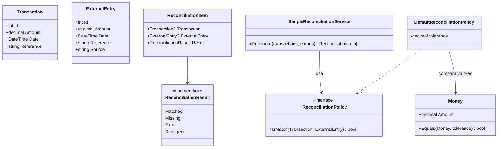

# Sistema de Conciliação Financeira

[](https://dotnet.microsoft.com/)
[](LICENSE)

Sistema de reconciliação automatizada de transações financeiras, construído com Domain-Driven Design (DDD) e .NET 10.

---

## System Design

### Visão de Contexto (C4 - Level 1)

```
???????????????????????????????????????????????????????????????????????????????
?                              SISTEMA DE CONCILIAÇÃO                         ?
???????????????????????????????????????????????????????????????????????????????
?                                                                             ?
?    ????????????????         ????????????????????????         ?????????????  ?
?    ?   Sistema    ?         ?                      ?         ?  Bancos   ?  ?
?    ?   Interno    ???????????   Reconciliation     ???????????  ERPs     ?  ?
?    ?  (ERP/Core)  ?         ?      Engine          ?         ?  Gateways ?  ?
?    ????????????????         ?                      ?         ?????????????  ?
?          ?                  ????????????????????????               ?        ?
?          ?                           ?                             ?        ?
?          ?                           ?                             ?        ?
?    ????????????????         ????????????????????????     ????????????????   ?
?    ? Transactions ?         ? ReconciliationItems  ?     ?ExternalEntries?  ?
?    ????????????????         ?  ??????????????????? ?     ????????????????   ?
?                             ?  ?Match?Miss ?Extra? ?                        ?
?                             ?  ??????????????????? ?                        ?
?                             ????????????????????????                        ?
?                                                                             ?
???????????????????????????????????????????????????????????????????????????????
```

### Arquitetura em Camadas

```
???????????????????????????????????????????????????????????????????
?                     API Layer (ASP.NET Core)                    ?
?                         [Em desenvolvimento]                    ?
???????????????????????????????????????????????????????????????????
?                     Application Layer                           ?
?              Orquestração e Casos de Uso                        ?
???????????????????????????????????????????????????????????????????
?                       Domain Layer                              ?
?  ???????????????  ???????????????  ???????????????????????????  ?
?  ?  Entities   ?  ?   Value     ?  ?       Services          ?  ?
?  ?             ?  ?   Objects   ?  ?                         ?  ?
?  ? Transaction ?  ?   Money     ?  ? SimpleReconciliation    ?  ?
?  ? ExternalEnt ?  ?             ?  ?       Service           ?  ?
?  ? Reconciliat ?  ?             ?  ?                         ?  ?
?  ?    ionItem  ?  ?             ?  ?                         ?  ?
?  ???????????????  ???????????????  ???????????????????????????  ?
?                                                ?                ?
?  ?????????????????????????????????????????????????????????????  ?
?  ?                      Policies                             ?  ?
?  ?  ???????????????????????????  ??????????????????????????  ?  ?
?  ?  ? IReconciliationPolicy   ???? DefaultReconciliation  ?  ?  ?
?  ?  ?      (interface)        ?  ?       Policy           ?  ?  ?
?  ?  ???????????????????????????  ??????????????????????????  ?  ?
?  ?????????????????????????????????????????????????????????????  ?
???????????????????????????????????????????????????????????????????
?                   Infrastructure Layer                          ?
?                      [Em desenvolvimento]                       ?
?              Database Access, External APIs, etc.               ?
???????????????????????????????????????????????????????????????????
```

---

## Modelo de Domínio



---

## Fluxo de Reconciliação

```
           ENTRADA                         PROCESSAMENTO                        SAÍDA
    ???????????????????                                                  ???????????????????
    ?   Transactions  ????                                           ????    Matched      ?
    ?  (Sistema Int.) ?  ?     ???????????????????????????????????   ?  ?  tx ? ext OK    ?
    ???????????????????  ?     ?                                 ?   ?  ???????????????????
                         ???????  SimpleReconciliationService    ?????
    ???????????????????  ?     ?                                 ?   ?  ???????????????????
    ? ExternalEntries ????     ?   ?????????????????????????     ?   ????    Missing      ?
    ? (Bancos, APIs)  ?        ?   ? IReconciliationPolicy ?     ?   ?  ?  tx sem ext     ?
    ???????????????????        ?   ?                       ?     ?   ?  ???????????????????
                               ?   ?  ? Reference match    ?     ?   ?
                               ?   ?  ? Date match         ?     ?   ?  ???????????????????
                               ?   ?  ? Amount ± tolerance ?     ?   ????     Extra       ?
                               ?   ?????????????????????????     ?      ?  ext sem tx     ?
                               ???????????????????????????????????      ???????????????????
```

### Algoritmo de Matching

```
PARA CADA transaction em Transactions:
    match ? Buscar ExternalEntry onde Policy.IsMatch(tx, ext) = true
    
    SE match encontrado:
        Adicionar ReconciliationItem(tx, match, MATCHED)
        Marcar match como usado
    SENÃO:
        Adicionar ReconciliationItem(tx, null, MISSING)

PARA CADA externalEntry não usado:
    Adicionar ReconciliationItem(null, ext, EXTRA)

RETORNAR lista de ReconciliationItems
```

### Critérios de Match (DefaultReconciliationPolicy)

| Critério | Regra |
|----------|-------|
| **Reference** | Exatamente igual |
| **Date** | Mesmo dia (ignora hora) |
| **Amount** | Diferença ? tolerância |

---

## Estrutura do Projeto

```
Conciliacao/
??? Conciliacao.Api/              # Web API (ASP.NET Core)
??? Conciliacao.Application/      # Casos de uso e orquestração
??? Conciliacao.Domain/           # Núcleo do domínio
?   ??? Entities/
?   ?   ??? Transaction.cs        # Transação interna
?   ?   ??? ExternalEntry.cs      # Entrada externa (banco, gateway)
?   ?   ??? ReconciliationItem.cs # Resultado da conciliação
?   ??? ValueObjects/
?   ?   ??? Money.cs              # Comparação monetária c/ tolerância
?   ??? Enums/
?   ?   ??? ReconciliationResult.cs
?   ??? Policies/
?   ?   ??? IReconciliationPolicy.cs
?   ?   ??? DefaultReconciliationPolicy.cs
?   ??? Services/
?       ??? SimpleReconciliationService.cs
??? Conciliacao.Infra/            # Persistência e integrações
??? Conciliacao.Domain.Tests/     # Testes unitários
```

---

## Decisões de Design

| Decisão | Motivação |
|---------|-----------|
| **Strategy Pattern** (Policies) | Permite trocar regras de matching sem alterar o serviço |
| **Value Object Money** | Encapsula comparação com tolerância, evita erros de ponto flutuante |
| **Imutabilidade em ReconciliationItem** | Resultados são read-only após criação |
| **HashSet para tracking** | O(1) para verificar entries já usados |
| **Separação Transaction/ExternalEntry** | Origens distintas = entidades distintas (Bounded Contexts) |

---

## Quick Start

```bash
# Clone e execute
git clone https://github.com/awernek/Conciliacao.git
cd Conciliacao
dotnet build
dotnet test
```

### Exemplo de Uso

```csharp
// Configurar
var policy = new DefaultReconciliationPolicy(tolerance: 0.01m);
var service = new SimpleReconciliationService(policy);

// Executar
var results = service.Reconcile(transactions, externalEntries);

// Analisar
var matched = results.Count(r => r.Result == ReconciliationResult.Matched);
var missing = results.Count(r => r.Result == ReconciliationResult.Missing);
var extra   = results.Count(r => r.Result == ReconciliationResult.Extra);
```

---

## Extensibilidade

Crie políticas customizadas implementando `IReconciliationPolicy`:

```csharp
public class StrictPolicy : IReconciliationPolicy
{
    public bool IsMatch(Transaction tx, ExternalEntry ext)
        => tx.Reference == ext.Reference 
        && tx.Date.Date == ext.Date.Date 
        && tx.Amount == ext.Amount; // Sem tolerância
}
```

---

## Roadmap

- [ ] API REST completa
- [ ] Persistência (EF Core)
- [ ] Suporte multi-moeda
- [ ] Processamento assíncrono (mensageria)
- [ ] Dashboard de visualização

---

## Licença

MIT License - veja [LICENSE](LICENSE) para detalhes.

**Autor:** [André Wernek](https://github.com/awernek)
