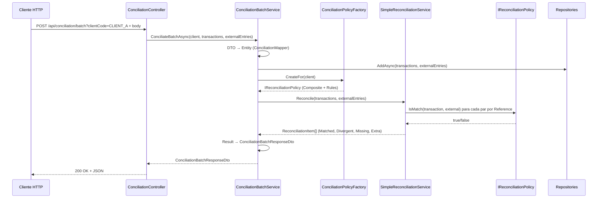
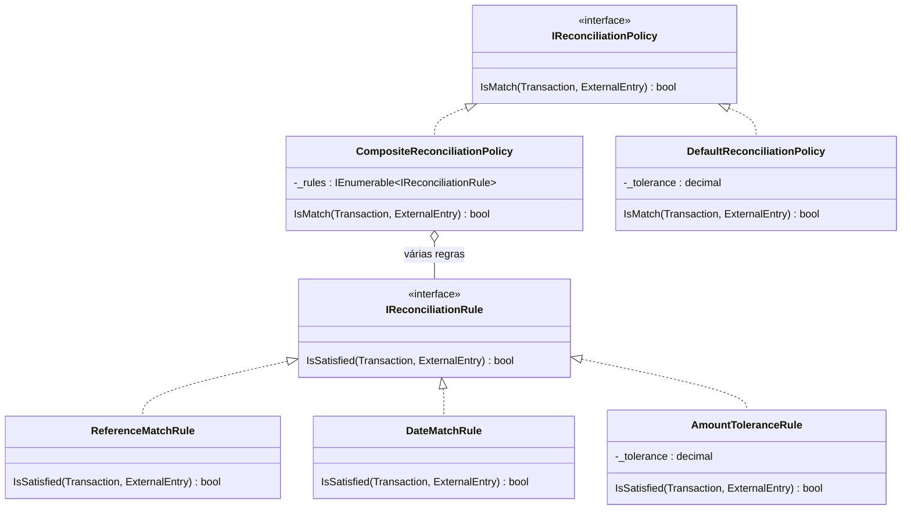
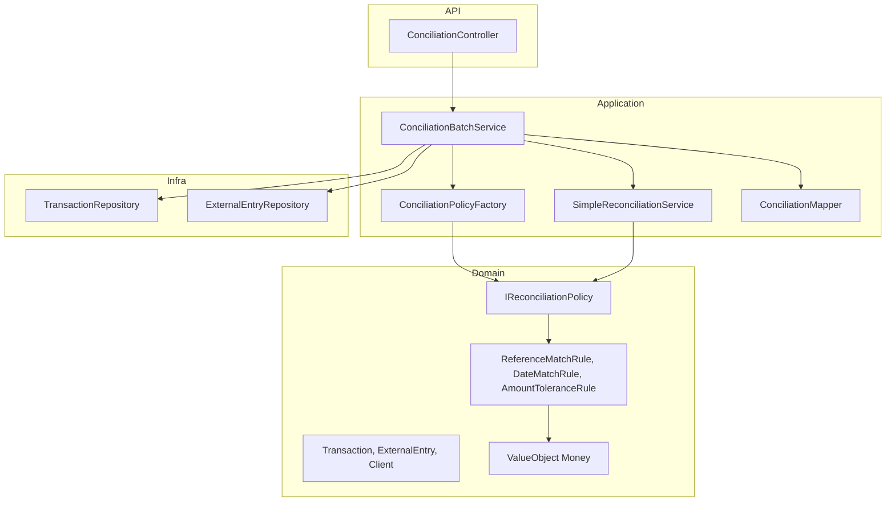

# Arquitetura e fluxo da aplicação de Conciliação

Documento didático para entender o que foi implementado nas camadas **Domain** e **Application**, com foco em DDD e domínio rico.

---

## 1. Visão geral: o que é conciliação?

**Conciliação** é o processo de comparar duas fontes de dados para descobrir:

- **Matched** — transação e entrada externa “batem” (mesma referência e critérios atendidos).
- **Divergent** — mesma referência, mas algum critério (valor, data etc.) diverge.
- **Missing** — transação existe no seu sistema, mas não há entrada externa correspondente.
- **Extra** — entrada externa existe, mas não há transação correspondente no seu sistema.

No seu projeto, as duas fontes são:

1. **Transactions** — transações do seu sistema (ex.: banco/ERP).
2. **ExternalEntries** — entradas vindas de fonte externa (ex.: extrato bancário, arquivo de retorno).

O “coração” do negócio está no **Domain**; a orquestração e a integração com o mundo externo ficam na **Application**.

---

## 2. Camadas do projeto (resumo)

```
┌─────────────────────────────────────────────────────────────────┐
│  API (Controllers)          ←  Entrada HTTP                     │
├─────────────────────────────────────────────────────────────────┤
│  Application (App Services) ←  Orquestra, mapeia, persiste       │
├─────────────────────────────────────────────────────────────────┤
│  Domain (Entities, Policies, Services)  ←  Regras de negócio     │
├─────────────────────────────────────────────────────────────────┤
│  Infra (Repositories, DbContext)  ←  Persistência, EF           │
└─────────────────────────────────────────────────────────────────┘
```

- **API**: recebe a requisição e chama o Application.
- **Application**: coordena repositórios, factory de política, serviço de lote e mapeamento DTO ↔ entidade.
- **Domain**: entidades, value objects, políticas de conciliação e serviço de conciliação “puro”.
- **Infra**: implementação dos repositórios e do banco.

A API expõe **dois fluxos** sob o recurso **Conciliação**: (1) **com idempotência** — POST /api/conciliation; (2) **em lote (sem idempotência)** — POST /api/conciliation/batch. O fluxo em lote é: **API → ConciliationBatchService → SimpleReconciliationService + Policy**.

---

## 3. Camada Domain (núcleo do negócio)

Aqui ficam apenas conceitos de negócio, sem referência a HTTP, banco ou DTOs.

### 3.1 Entidades

| Entidade | Papel |
|----------|--------|
| **Transaction** | Uma transação do seu sistema: `Id`, `Amount`, `Date`, `Reference`. |
| **ExternalEntry** | Uma entrada externa: `Id`, `Amount`, `Date`, `Reference`, `Source`. |
| **Client** | Cliente para o qual se concilia; usado para escolher a **política** (ex.: `Code = "CLIENT_A"`). |
| **ReconciliationItem** | Resultado de um par (ou item sozinho): guarda `Transaction?`, `ExternalEntry?` e o tipo de resultado (`Matched`, `Missing`, `Extra`). Usado pelo `SimpleReconciliationService`. |

### 3.2 Value Object

- **Money**: encapsula valor monetário e a comparação com **tolerância** (`Equals(other, tolerance)`). Usado nas regras de valor (ex.: `AmountToleranceRule`).

### 3.3 Enum

- **ReconciliationResult**: `Matched`, `Divergent`, `Missing`, `Extra`.

### 3.4 Políticas de conciliação (Strategy + Composite)

A pergunta central do domínio é: **“esta Transaction e esta ExternalEntry formam um par conciliado ou divergente?”**

Isso não é uma regra fixa: depende do **cliente**. Por isso foi usado:

1. **Interface `IReconciliationPolicy`** (Strategy):

   ```csharp
   bool IsMatch(Transaction transaction, ExternalEntry externalEntry);
   ```

2. **Implementações**:
   - **DefaultReconciliationPolicy**: uma política “tudo em um” (referência + data + tolerância de valor).
   - **CompositeReconciliationPolicy**: monta a política a partir de **várias regras** que precisam ser **todas** satisfeitas.

3. **Regras atômicas (`IReconciliationRule`)**:
   - **ReferenceMatchRule**: mesma referência.
   - **DateMatchRule**: mesma data (comparação por `.Date`).
   - **AmountToleranceRule**: valores iguais dentro de uma tolerância (usa o value object `Money`).

O **Composite** faz: `IsMatch = _rules.All(rule => rule.IsSatisfied(transaction, externalEntry))`.

Assim você pode combinar regras por cliente (ex.: CLIENT_A com tolerância 0,05; CLIENT_B com 0; CLIENT_C sem regra de data).

### 3.5 Serviço de domínio: SimpleReconciliationService

- Recebe: lista de `Transaction`, lista de `ExternalEntry`, e uma `IReconciliationPolicy`.
- Para cada transação, procura **uma** entrada externa que satisfaça a política (`FirstOrDefault`).
- Gera `ReconciliationItem` para cada transação (Matched ou Missing) e para cada entrada externa não utilizada (Extra).
- Retorna uma coleção de `ReconciliationItem`.

Esse serviço **não** sabe de cliente, HTTP ou persistência; só de entidades e política. O fluxo em lote que a API usa hoje é o **ConciliationBatchService** (Application), que usa a mesma ideia de política mas com outro formato de resultado e critério de “par” por referência.

---

## 4. Camada Application (orquestração)

Aqui a aplicação coordena: entrada (DTOs), persistência (repositórios), criação da política (factory), execução da conciliação e saída (DTOs).

### 4.1 ConciliationBatchService

É o **caso de uso** “conciliar em lote”:

1. **Entrada**: `Client`, listas de `TransactionDto` e `ExternalEntryDto`.
2. **Mapeia** DTO → entidade (`ConciliationMapper.ToEntity`).
3. **Persiste** transações e entradas externas (repositórios).
4. **Obtém a política** do cliente: `_factory.CreateFor(client)` → `IReconciliationPolicy`.
5. **Executa a conciliação**: cria `SimpleReconciliationService` (Domain) com essa política e chama `Reconcile(transactions, externalEntries)`.
6. **Mapeia** o resultado para `ConciliationBatchResponseDto` (Missing, Extra, Matched, Divergent) e devolve.

Ou seja: o App Service **não** implementa a lógica de “quando dois itens batem”; ele só coordena dados, persistência e chamada ao serviço que usa a política.

### 4.2 SimpleReconciliationService (Domain)

O ConciliationBatchService usa o **SimpleReconciliationService** do Domain:

- Recebe: listas de `Transaction` e `ExternalEntry` (já entidades) e uma `IReconciliationPolicy`.
- **Agrupa** entradas externas por `Reference` (um dicionário por referência).
- Para **cada transação**:
  - Se não existe entrada externa com a mesma referência → vai para **Missing**.
  - Se existe:
    - Se `_policy.IsMatch(transaction, external)` → **Matched**.
    - Senão → **Divergent**.
- Entradas externas que nunca foram “usadas” por nenhuma transação → **Extra**.
- Retorna uma coleção de **ReconciliationItem** (cada um com Transaction, ExternalEntry e Result). O **ConciliationBatchService** converte em **ConciliationBatchResponseDto**.

- O serviço de domínio procura “qualquer” entrada que dê match (e produz `ReconciliationItem`).
### 4.3 ConciliationPolicyFactory (Factory no Application)

- **Interface**: `IConciliationPolicyFactory` → `CreateFor(Client)` retorna `IReconciliationPolicy` (Domain).
- **Implementação**: conforme `client.Code` monta um `CompositeReconciliationPolicy` com as regras desejadas:
  - **CLIENT_A**: Reference + Date + AmountTolerance(0,05).
  - **CLIENT_B**: Reference + Date + AmountTolerance(0).
  - **CLIENT_C**: Reference + AmountTolerance(0,10) (sem data).
  - Outros códigos → exceção.

A factory **conhece** o domínio (entidades, políticas, regras), mas a **decisão** de qual política usar é de configuração por cliente, por isso ficou na Application.

### 4.4 ConciliationMapper

- Métodos estáticos: `ToEntity` e `ToDto` para `Transaction` e `ExternalEntry` (namespace `Application.DTOs.Conciliation`).
- Mantém a API e a persistência falando em DTOs, e o domínio em entidades.

### 4.5 DTOs e modelo de resultado

- **ConciliationBatchResponseDto**: contém listas `Missing`, `Extra`, `Matched`, `Divergent` (Matched/Divergent como `MatchedPairDto` com `Transaction` e `ExternalEntry` em DTO).
- O **ConciliationBatchService** usa o `SimpleReconciliationService` (Domain), que retorna `ReconciliationItem`; o serviço de aplicação converte para `ConciliationBatchResponseDto`.

---

## 5. Fluxo completo (da API até a resposta)

Diagrama em sequência:

```
Cliente HTTP                ConciliationController    ConciliationBatchService        Factory              SimpleReconciliationService    Policy
      │                           │                              │                        │                              │                          │
      │  POST /api/conciliation/batch?clientCode=CLIENT_A        │                        │                              │                          │
      │  Body: { Transactions, ExternalEntries }                  │                        │                              │                          │
      │──────────────────────────>│                              │                        │                              │                          │
      │                           │  ConciliateBatchAsync(client, DTOs)                    │                              │                          │
      │                           │─────────────────────────────>│                        │                              │                          │
      │                           │                              │  Map DTO → Entity       │                              │                          │
      │                           │                              │  Persist (repos)        │                              │                          │
      │                           │                              │  CreateFor(client)      │                              │                          │
      │                           │                              │───────────────────────>│                              │                          │
      │                           │                              │  IReconciliationPolicy │                              │                          │
      │                           │                              │<───────────────────────│                              │                          │
      │                           │                              │  Reconcile(trans, ext)  │                              │                          │
      │                           │                              │─────────────────────────────────────────────────────>│                          │
      │                           │                              │                        │  IsMatch(trans, ext)          │                          │
      │                           │                              │                        │─────────────────────────────────────────────────────>│
      │                           │                              │                        │  true/false                  │                          │
      │                           │                              │                        │<─────────────────────────────────────────────────────│
      │                           │                              │  ReconciliationItem[] (Matched, Divergent, Missing, Extra)                      │
      │                           │                              │<─────────────────────────────────────────────────────│                          │
      │                           │                              │  Map Result → DTO       │                              │                          │
      │                           │  ConciliationBatchResponseDto│                        │                              │                          │
      │                           │<─────────────────────────────│                        │                              │                          │
      │  200 + JSON response      │                              │                        │                              │                          │
      │<──────────────────────────│                              │                        │                              │                          │
```

Resumo em passos:

1. **ConciliationController** recebe `clientCode` e body com `Transactions` e `ExternalEntries` (DTOs) em POST /api/conciliation/batch.
2. **ConciliationBatchService.ConciliateBatchAsync**:
   - Converte DTOs em entidades e persiste.
   - Pede à **IConciliationPolicyFactory** a política do cliente.
   - Instancia **SimpleReconciliationService** (Domain) com essa política e chama **Reconcile**.
   - Converte os **ReconciliationItem** em **ConciliationBatchResponseDto** e retorna.
3. **SimpleReconciliationService** emparelha por referência e, para cada par, usa **IReconciliationPolicy.IsMatch** para classificar em Matched ou Divergent; monta Missing e Extra.
4. **Controller** devolve 200 e o DTO em JSON.

---

## 6. Diagrama de dependências (camadas)

```
                    ┌──────────────────┐
                    │  Conciliation    │
                    │   Controller     │
                    └────────┬─────────┘
                             │ usa
                             ▼
                    ┌──────────────────┐
                    │ Conciliation     │     ┌─────────────────────┐
                    │ BatchService     │────>│ IConciliation       │
                    └────────┬─────────┘     │ PolicyFactory       │
                             │               └──────────┬──────────┘
         ┌───────────────────┼───────────────────┐      │
         │                   │                   │      │
         ▼                   ▼                   ▼      ▼
┌────────────────┐  ┌────────────────┐  ┌─────────────────────┐
│ ITransaction   │  │ IExternalEntry  │  │ SimpleReconciliation │
│ Repository     │  │ Repository      │  │ Service (Domain)     │
└────────────────┘  └────────────────┘  └──────────┬────────────┘
         │                   │                    │
         │                   │                    │ usa
         │                   │                    ▼
         │                   │           ┌─────────────────────┐
         │                   │           │ IReconciliation    │
         │                   │           │ Policy (Domain)     │
         │                   │           └──────────┬──────────┘
         │                   │                      │
         ▼                   ▼                      ▼
┌─────────────────────────────────────────────────────────────────┐
│                        DOMAIN                                    │
│  Entities: Transaction, ExternalEntry, Client, ReconciliationItem│
│  ValueObjects: Money                                             │
│  Policies: CompositeReconciliationPolicy + Rules                 │
│  Services: SimpleReconciliationService (alternativo)             │
└─────────────────────────────────────────────────────────────────┘
```

- A **API** depende dos serviços de aplicação (ConciliationBatchService, ConciliationService) e dos DTOs.
- O **ConciliationBatchService** depende das interfaces de repositório, da factory e do SimpleReconciliationService (Domain).
- O **SimpleReconciliationService** depende apenas de `IReconciliationPolicy` e entidades (Domain).
- A **ConciliationPolicyFactory** monta políticas do Domain (Composite + Rules) a partir do `Client`.

---

## 7. Conceitos DDD / domínio rico usados

| Conceito | Onde aparece |
|----------|-------------------------------|
| **Entidade** | Transaction, ExternalEntry, Client, ReconciliationItem. |
| **Value Object** | Money (imutável em uso, comparação com tolerância). |
| **Serviço de domínio** | SimpleReconciliationService: orquestra entidades e política sem ser “dono” de uma entidade. |
| **Política (Strategy)** | IReconciliationPolicy: “como decidir se dois itens batem” varia por cliente. |
| **Composite** | CompositeReconciliationPolicy: combina várias regras (todas devem ser satisfeitas). |
| **Regras atômicas** | IReconciliationRule: ReferenceMatchRule, DateMatchRule, AmountToleranceRule. |
| **Repositórios (interfaces no Domain)** | ITransactionRepository, IExternalEntryRepository; implementação na Infra. |
| **Application Service** | ConciliationBatchService: um caso de uso (“conciliar em lote”), coordena repositórios, factory e SimpleReconciliationService. |
| **Factory (Application)** | ConciliationPolicyFactory: cria a política correta para cada cliente. |

---

## 8. Resumo em uma frase por camada

- **Domain**: “Dado uma transação e uma entrada externa, esta política diz se elas formam um par conciliado; o serviço de domínio (ou o de lote na Application) usa essa política para classificar pares em Matched, Divergent, Missing e Extra.”
- **Application**: “Recebo DTOs e código do cliente; persisto os dados, pego a política do cliente, executo a conciliação em lote com essa política e devolvo o resultado em DTOs.”
- **API**: “Exponho o caso de uso de conciliação em lote via POST, repassando cliente e body para o App Service.”

Se quiser, no próximo passo podemos aprofundar só nas políticas (como adicionar uma nova regra ou um novo cliente) ou só no fluxo do ConciliationBatchService (passo a passo com um exemplo numérico).

---

## 9. Diagramas Mermaid (opcional)

Se você usar GitHub, GitLab ou outra ferramenta que renderize Mermaid, os blocos abaixo viram diagramas.

### Fluxo da conciliação em lote



### Estrutura das políticas (Strategy + Composite)



### Camadas e dependências


