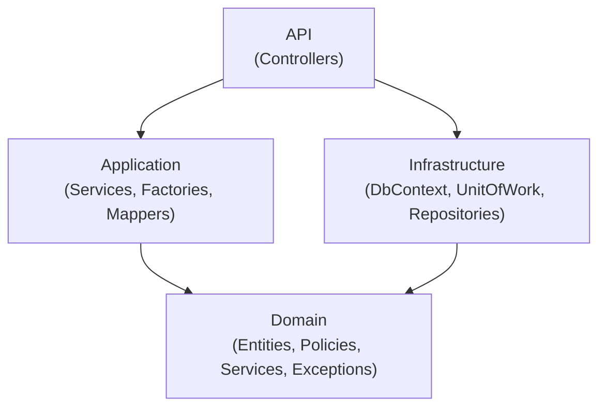
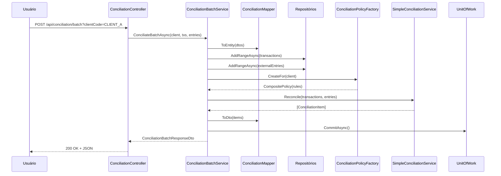
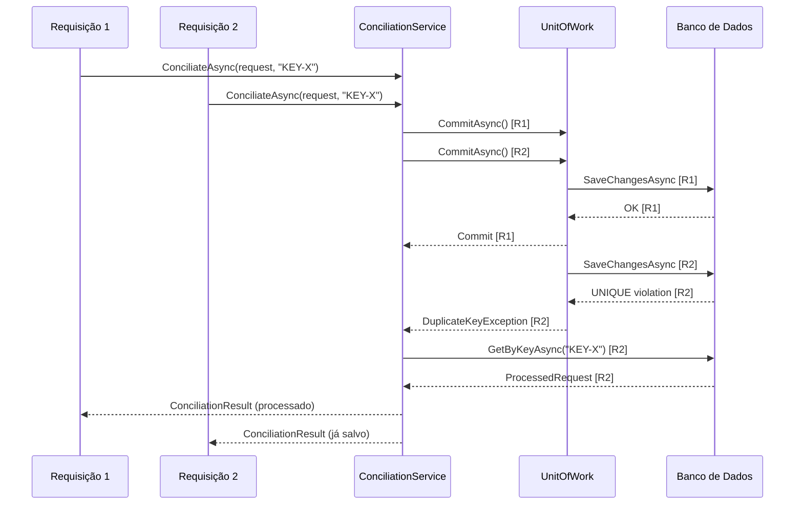
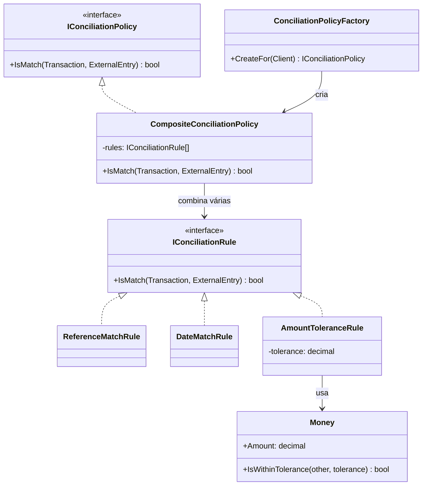
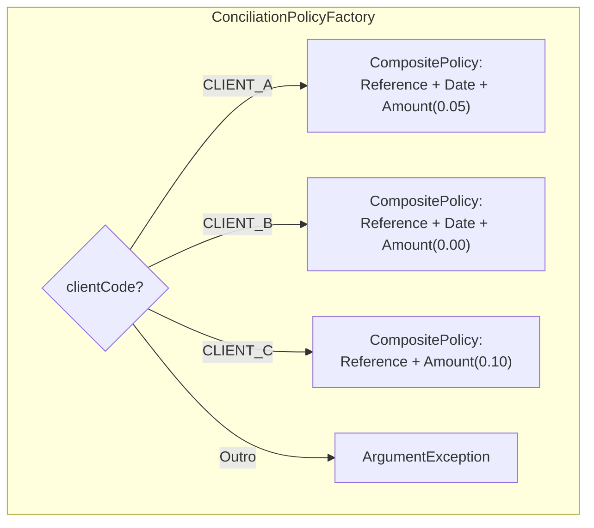

# Como Funciona o Sistema de Conciliação Financeira

> Guia didático para entender o projeto completo  do conceito ao código.

---

## Sumário

1. O que é conciliação financeira?
2. Analogia do dia a dia
3. O que o sistema faz (em uma frase)
4. Arquitetura do projeto (camadas)
5. Os dois fluxos da API
6. Fluxo 1: Conciliação em lote (Batch)
7. Fluxo 2: Conciliação idempotente
8. Políticas por cliente  como funciona o matching
9. Exemplo prático com dados reais
10. Conceitos técnicos importantes
11. Padrões de projeto utilizados
12. Estrutura de pastas
13. Glossário
14. Diagramas

---

## 1. O que é conciliação financeira?

**Conciliação** (ou reconciliação) é o processo de **comparar duas fontes de dados financeiros** para descobrir se elas estão de acordo.

Imagine que você tem:
- **Seu registro interno** (o que o seu sistema diz que aconteceu)
- **O extrato do banco** (o que o banco diz que aconteceu)

A conciliação compara os dois e classifica cada item em uma dessas categorias:

| Categoria | O que significa | Exemplo |
|-----------|----------------|---------|
| **Matched** (Conciliado) | Os dois lados batem  | Você registrou R$100 e o banco também mostra R$100 |
| **Divergent** (Divergente) | Mesma referência, mas algo difere  | Mesma transação, mas seu sistema diz R$100 e o banco diz R$105 |
| **Missing** (Faltando) | Está no seu sistema, mas NÃO no banco  | Você registrou uma venda, mas o banco não recebeu |
| **Extra** | Está no banco, mas NÃO no seu sistema  | O banco tem um depósito que seu sistema não conhece |

---

## 2. Analogia do dia a dia

Pense na conciliação como **conferir a lista de compras**:

1. Você fez uma lista no papel: "maçã, banana, leite"
2. Quando chega em casa, olha a sacola: "maçã, banana, suco"
3. Resultado:
   - **Matched**: maçã , banana 
   - **Missing**: leite (estava na lista mas não veio) 
   - **Extra**: suco (veio mas não estava na lista) 

O sistema faz isso automaticamente, mas com transações financeiras!

---

## 3. O que o sistema faz (em uma frase)

> "Recebe transações do seu sistema e lançamentos externos (banco/gateway), compara os dois usando regras configuráveis por cliente, e retorna quais bateram, quais divergiram, quais estão faltando e quais são extras."

---

## 4. Arquitetura do projeto (camadas)

O projeto segue **Clean Architecture** (Arquitetura Limpa) com 4 camadas. Cada camada tem uma responsabilidade específica:

```

   API (Conciliacao.Api)                                   
  Recebe as requisições HTTP e devolve respostas JSON        

   Application (Conciliacao.Application)                    
  Orquestra: mapeia dados, persiste, executa conciliação     
   Não depende de EF Core  apenas do Domain               

   Domain (Conciliacao.Domain)                              
  Regras de negócio puras (entidades, políticas, regras)     
  Exceções de domínio (DuplicateKeyException)                

   Infrastructure (Conciliacao.Infra)                       
  Banco de dados, Entity Framework, repositórios concretos   
  UnitOfWork (traduz exceções de infra  domínio)            

```

### Por que separar em camadas?

- **Cada camada só conhece a de baixo**  a API não conhece o banco de dados diretamente.
- **Trocar o banco** (ex: de SQL Server para PostgreSQL) exige mudar só a infraestrutura.
- **Testar é fácil**  podemos usar fakes no lugar dos repositórios reais.
- **Application limpa**  não depende de EF Core; toda tradução de exceção de infra fica no UnitOfWork.



---

## 5. Os dois fluxos da API

O sistema expõe **dois endpoints** no mesmo controller (`ConciliationController`):

| Endpoint | Para que serve | Quando usar |
|----------|---------------|-------------|
| `POST /api/conciliation/batch?clientCode=` | Conciliação em **lote** (persistência + matching) | Enviar batch de transações + entradas externas para classificar |
| `POST /api/conciliation` | Conciliação **idempotente** (com chave de segurança) | Garantir que a mesma operação nunca seja processada duas vezes |

### Diferença principal
- **Batch**: foco em **classificar** (Matched, Divergent, Missing, Extra).
- **Idempotente**: foco em **segurança** (nunca duplicar uma operação, mesmo com falhas de rede).

---

## 6. Fluxo 1: Conciliação em lote (Batch)

### Passo a passo

```
Usuário  Controller  ConciliationBatchService  Mapper  Repositórios  Factory  SimpleConciliationService  Políticas  Commit  Resposta
```

#### 1. O usuário faz uma requisição HTTP

```http
POST /api/conciliation/batch?clientCode=CLIENT_A
Content-Type: application/json

{
  "transactions": [
    { "reference": "TX-001", "amount": 100.00, "date": "2025-01-10" },
    { "reference": "TX-002", "amount": 200.00, "date": "2025-01-11" }
  ],
  "externalEntries": [
    { "reference": "TX-001", "amount": 100.03, "date": "2025-01-10" },
    { "reference": "TX-999", "amount": 50.00, "date": "2025-01-12" }
  ]
}
```

#### 2. O `ConciliationController` recebe e encaminha

O controller recebe clientCode (query) e body. Cria `Client(clientCode)` e chama `ConciliationBatchService.ConciliateBatchAsync(client, transactions, externalEntries)`.

#### 3. O `ConciliationBatchService` orquestra

```
ConciliationBatchService
 1. Mapeia DTOs  Entidades (ConciliationMapper)
 2. Persiste transações e entradas externas (repositórios)
 3. Obtém a política do cliente (ConciliationPolicyFactory)
 4. Executa o matching (SimpleConciliationService do Domain)
 5. Mapeia resultado  DTO de resposta
 6. Faz commit (UnitOfWork.CommitAsync)
```

#### 4. O `SimpleConciliationService` (Domain) faz o matching

O serviço de domínio recebe transações, entradas externas e a política. Para cada transação, tenta encontrar uma entrada externa com a mesma referência e aplica a política:

- **Matched**: mesma referência E a política retorna `true` (todas as regras satisfeitas)
- **Divergent**: mesma referência MAS a política retorna `false`
- **Missing**: transação sem nenhuma entrada externa correspondente
- **Extra**: entrada externa sem nenhuma transação correspondente

#### 5. Resposta JSON

```json
{
  "matched": [
    {
      "transaction": { "reference": "TX-001", "amount": 100.00, "date": "2025-01-10" },
      "externalEntry": { "reference": "TX-001", "amount": 100.03, "date": "2025-01-10" }
    }
  ],
  "divergent": [],
  "missing": [
    { "reference": "TX-002", "amount": 200.00, "date": "2025-01-11" }
  ],
  "extra": [
    { "reference": "TX-999", "amount": 50.00, "date": "2025-01-12" }
  ]
}
```

> TX-001 é **Matched** porque a diferença de R$0,03 está dentro da tolerância de R$0,05 do CLIENT_A.



---

## 7. Fluxo 2: Conciliação idempotente

### O que é idempotência?

> "Não importa quantas vezes você envie a mesma requisição  o resultado será sempre o mesmo, e a operação não será duplicada."

Imagine que você clica "Pagar" e a internet cai. Você não sabe se o pagamento foi processado. Com idempotência, você pode clicar de novo com segurança  a API reconhece que já processou aquela requisição.

### Requisição HTTP

```http
POST /api/conciliation
Idempotency-Key: abc-123-def
Content-Type: application/json

{
  "items": [
    { "reference": "REF-001", "amount": 100.50 },
    { "reference": "REF-002", "amount": 200.00 }
  ]
}
```

### Comportamento

1. **Primeira requisição** com `Idempotency-Key: abc-123-def`:
   - Cria transações a partir dos itens
   - Salva transações + ProcessedRequest (chave + hash do resultado)
   - Retorna `ConciliationResult` (success: true, processedCount: 2)

2. **Segunda requisição** com a **mesma** chave:
   - `UnitOfWork` tenta fazer commit, detecta violação de UNIQUE
   - `UnitOfWork` traduz `DbUpdateException`  `DuplicateKeyException` (exceção de domínio)
   - `ConciliationService` captura `DuplicateKeyException`
   - Busca ProcessedRequest pela chave e retorna resultado já salvo
   - **Não reprocessa!**

### Concorrência



> A chave `DuplicateKeyException` é uma exceção de **domínio**  o `UnitOfWork` (Infra) traduz a `DbUpdateException` do EF Core para ela, mantendo a camada Application independente de EF Core.

---

## 8. Políticas por cliente  como funciona o matching

Cada cliente pode ter **regras diferentes** para decidir se uma transação e uma entrada externa "batem". O sistema usa os padrões **Strategy** e **Composite**.

### Regras disponíveis

| Regra | O que verifica |
|-------|---------------|
| `ReferenceMatchRule` | Mesma referência |
| `DateMatchRule` | Mesma data |
| `AmountToleranceRule` | Valor dentro de tolerância |

### Composição por cliente

| Cliente | Regras | Tolerância |
|---------|--------|---------------------|
| **CLIENT_A** | Referência + Data + Valor | R$0,05 |
| **CLIENT_B** | Referência + Data + Valor | R$0,00 (exato) |
| **CLIENT_C** | Referência + Valor (sem data!) | R$0,10 |

A `ConciliationPolicyFactory` usa `CompositeConciliationPolicy` para compor as regras de cada cliente:





---

## 9. Exemplo prático com dados reais

### Cenário: CLIENT_A (tolerância de R$0,05)

**Transações internas:**
| Reference | Amount | Date |
|-----------|--------|------|
| TX-001 | 100,00 | 2025-01-10 |
| TX-002 | 200,00 | 2025-01-11 |
| TX-003 | 50,00 | 2025-01-12 |

**Entradas externas (banco):**
| Reference | Amount | Date |
|-----------|--------|------|
| TX-001 | 100,03 | 2025-01-10 |
| TX-002 | 210,00 | 2025-01-11 |
| TX-999 | 75,00 | 2025-01-15 |

**Resultado:**
| Item | Classificação | Motivo |
|------|---------------|--------|
| TX-001 |  **MATCHED** | Diferença de R$0,03  tolerância de R$0,05 |
| TX-002 |  **DIVERGENT** | Diferença de R$10,00 > tolerância de R$0,05 |
| TX-003 |  **MISSING** | Não existe no banco |
| TX-999 |  **EXTRA** | Não existe no sistema |

---

## 10. Conceitos técnicos importantes

### Unit of Work (Unidade de Trabalho)

"Ou salva tudo, ou não salva nada."

O `ConciliationBatchService` chama vários repositórios (AddRangeAsync), mas o commit (SaveChangesAsync) só acontece **no final**, via `UnitOfWork.CommitAsync()`. Se ocorrer uma exceção antes do commit, nada é gravado no banco.

O `UnitOfWork` (Infra) também é responsável por **traduzir exceções**: se o banco retornar violação de chave única (SQL Server códigos 2601/2627), o UnitOfWork traduz para `DuplicateKeyException` (exceção de domínio), mantendo a camada Application limpa.

### DuplicateKeyException (Exceção de Domínio)

Exceção de domínio que representa violação de chave única. Definida em `Conciliacao.Domain.Exceptions`. O `UnitOfWork` na infraestrutura traduz `DbUpdateException`  `DuplicateKeyException`, eliminando a dependência de EF Core na Application.

### Value Object: Money

Encapsula valores monetários. Permite comparar com **tolerância** (ex.: R$100,00 vs R$100,03 com tolerância de R$0,05  `true`).

### Repositórios e interfaces

O Domain define **interfaces** (`ITransactionRepository`, etc.). A Infrastructure implementa com EF Core. Os testes usam **fakes** (in-memory) que implementam as mesmas interfaces.

### Client (encapsulado)

A entidade `Client` tem construtor com guarda de null (`ArgumentNullException`) e setter privado para `Code`. Protege invariantes de domínio.

---

## 11. Padrões de projeto utilizados

| Padrão | Onde é usado | Para que serve |
|--------|-------------|----------------|
| **Strategy** | `IConciliationPolicy` | Trocar a lógica de matching sem mudar o código que usa |
| **Composite** | `CompositeConciliationPolicy` | Combinar várias regras pequenas em uma política completa |
| **Factory** | `ConciliationPolicyFactory` | Criar a política certa para cada cliente |
| **Unit of Work** | `UnitOfWork` (implementa `IUnitOfWork`) | Garantir commit atômico (tudo ou nada) + traduzir exceções |
| **Repository** | `ITransactionRepository`, etc. | Abstrair o acesso ao banco de dados |
| **Mapper** | `ConciliationMapper` | Converter entre DTOs (API) e entidades (domínio) |
| **Domain Service** | `SimpleConciliationService` | Lógica de matching pura no domínio |
| **Value Object** | `Money` | Comparação de valores com semântica de negócio (tolerância) |
| **Domain Exception** | `DuplicateKeyException` | Violação de chave única como conceito de domínio |

---

## 12. Estrutura de pastas

```
Conciliacao/
 Conciliacao.Api/               # Camada de API (REST)
    Controllers/
       ConciliationController.cs   # Único controller (batch + idempotente)
    Program.cs                      # DI, Swagger, pipeline

 Conciliacao.Application/       # Camada de Aplicação (orquestra)
    DTOs/Conciliation/              # ConciliationBatchRequestDto, ResponseDto, TransactionDto, etc.
    Requests/                       # ConciliationRequest, ConciliationItem
    Results/                        # ConciliationResult
    Factories/                      # IConciliationPolicyFactory, ConciliationPolicyFactory
    Mappers/                        # ConciliationMapper (ToEntity, ToDto)
    Services/
        ConciliationBatchService    # Fluxo batch (persistência + matching)
        ConciliationService         # Fluxo idempotente

 Conciliacao.Domain/            # Camada de Domínio (núcleo)
    Entities/                       # Transaction, ExternalEntry, Client, ConciliationItem,
                                      # ProcessedRequest, Conciliation
    Enums/                          # ConciliationStatus (Matched, Divergent, Missing, Extra)
    Exceptions/                     # DuplicateKeyException
    Policies/                       # IConciliationPolicy, IConciliationRule,
                                      # CompositeConciliationPolicy, Rules
    Repositories/                   # ITransactionRepository, IExternalEntryRepository,
                                      # IProcessedRequestRepository, IUnitOfWork
    Services/                       # SimpleConciliationService
    ValueObjects/                   # Money

 Conciliacao.Infra/             # Camada de Infraestrutura
    Contexts/                       # ConciliationDbContext, ConciliationDbContextFactory
    Persistence/                    # UnitOfWork (commit + tradução de exceções)
    Repositories/                   # Implementações concretas (EF Core)
    Configurations/                 # Mapeamento EF para cada entidade
    Migrations/

 Conciliacao.Domain.Tests/      # Testes unitários de domínio e application
 Conciliacao.Api.Tests/         # Testes de integração (API + concorrência)
```

---

## 13. Glossário

| Termo | Significado |
|-------|------------|
| **Transaction** | Uma transação do seu sistema interno |
| **ExternalEntry** | Um lançamento vindo de fonte externa |
| **Reference** | Código que identifica a transação |
| **Policy** | Conjunto de regras que define se Transaction e ExternalEntry "batem" |
| **Rule** | Uma regra individual (ex.: ReferenceMatchRule) |
| **Matched** | Transaction e ExternalEntry formam um par que atende à política |
| **Divergent** | Mesma referência, mas alguma regra não foi satisfeita |
| **Missing** | Transaction sem ExternalEntry correspondente |
| **Extra** | ExternalEntry sem Transaction correspondente |
| **Idempotency-Key** | Chave única que garante que a mesma requisição não é processada duas vezes |
| **ProcessedRequest** | Registro no banco que armazena a chave de idempotência e o resultado |
| **Unit of Work** | Padrão que garante commit atômico (tudo ou nada) |
| **DuplicateKeyException** | Exceção de domínio para violação de chave única (traduzida pelo UnitOfWork) |
| **DTO** | Data Transfer Object |
| **DDD** | Domain-Driven Design |
| **Clean Architecture** | Arquitetura em camadas onde o domínio não depende de frameworks ou banco |

---

## 14. Diagramas

Todos os diagramas do projeto estão no arquivo: **[DIAGRAMAS-PROJETO.md](../docs/DIAGRAMAS-PROJETO.md)**

Contém **12 diagramas** organizados em dois níveis de abstração:

###  Diagramas de Alto Nível (Vision/System Design)
1. Contexto Geral
2. Fluxo de Dados de Alto Nível
3. Arquitetura de Containers
4. Dois Fluxos Principais (lado a lado)

###  Diagramas Técnicos Detalhados
5. Visão geral das camadas
6. Fluxo batch completo
7. Fluxo idempotente
8. Políticas de conciliação
9. Configuração por cliente
10. Entidades do domínio
11. Consistência: Unit of Work
12. Concorrência na idempotência

---

> **Resumo em 3 frases:**
> O sistema recebe transações internas e lançamentos externos, e classifica cada par como Matched, Divergent, Missing ou Extra usando regras configuráveis por cliente (Strategy + Composite). O fluxo batch persiste e concilia de uma só vez com commit atômico (tudo ou nada) via `ConciliationBatchService`. O fluxo idempotente protege contra duplicatas usando `DuplicateKeyException` (traduzida pelo UnitOfWork), chave única e tratamento de concorrência.