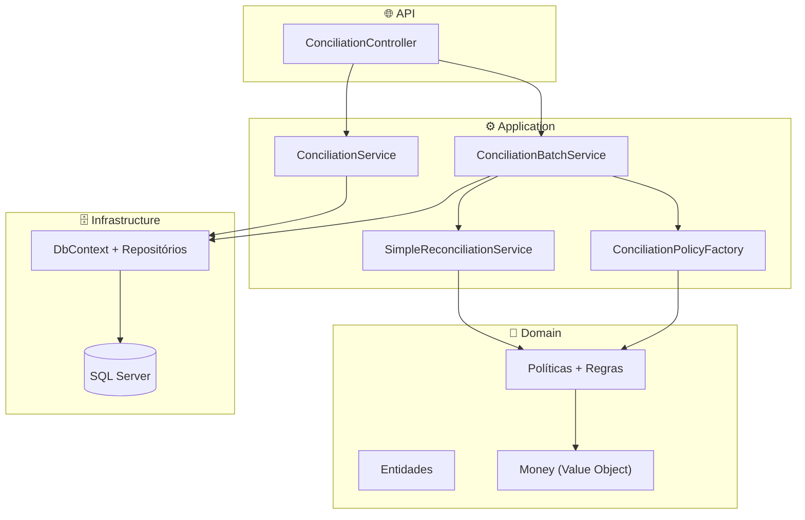
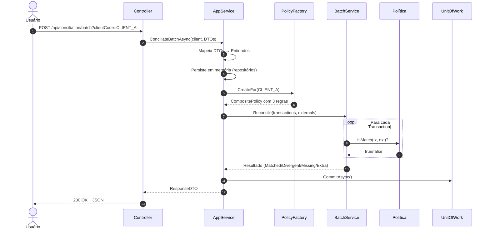
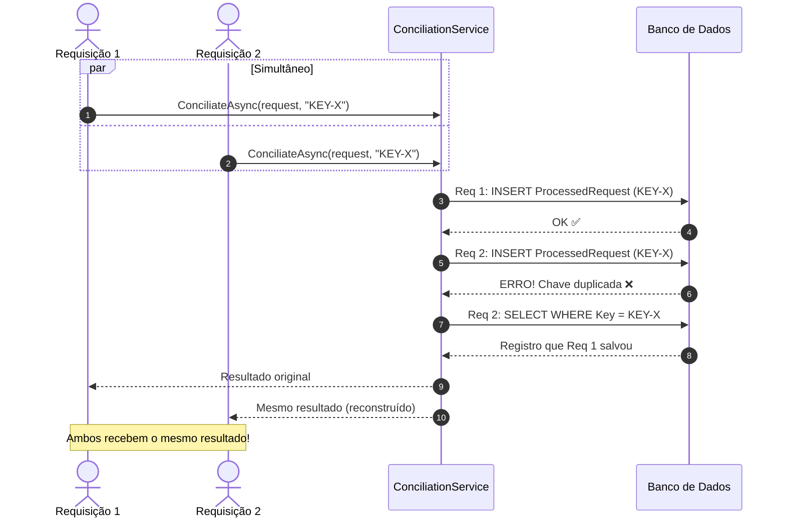
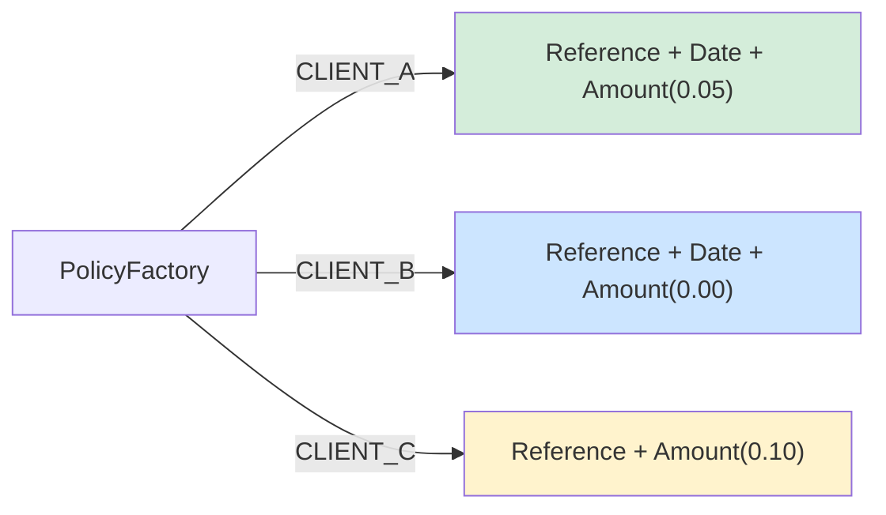
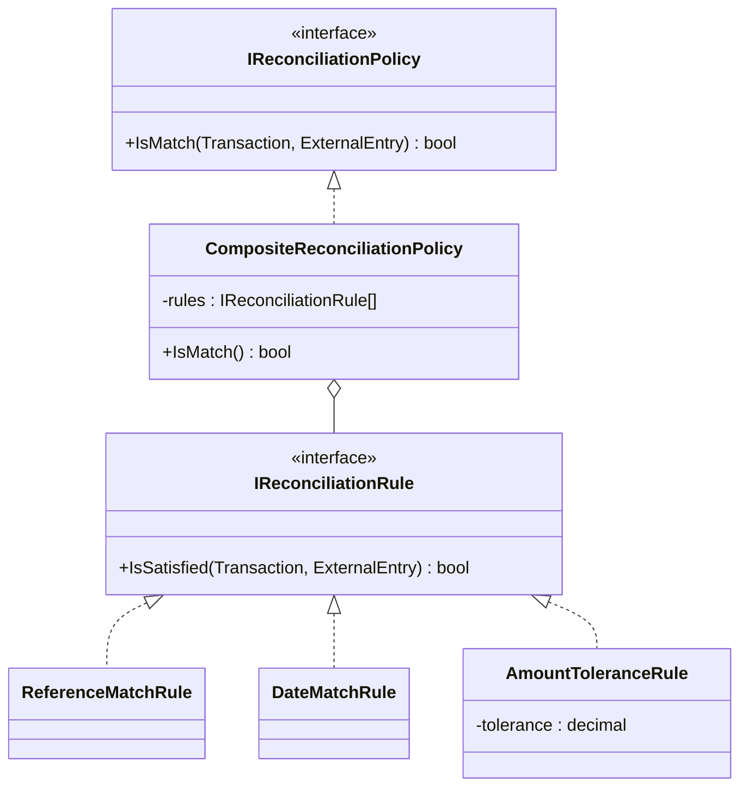
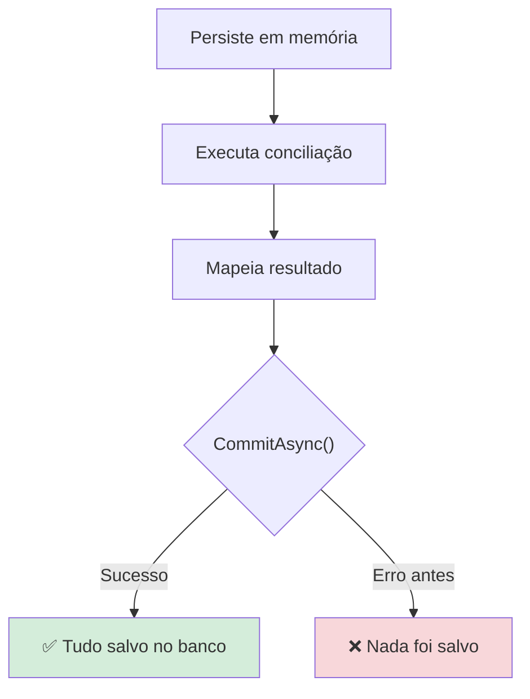

# Como Funciona o Sistema de Conciliação Financeira

> Guia didático para entender o projeto completo — do conceito ao código.

---

## Sumário

1. [O que é conciliação financeira?](#1-o-que-é-conciliação-financeira)
2. [Analogia do dia a dia](#2-analogia-do-dia-a-dia)
3. [O que o sistema faz (em uma frase)](#3-o-que-o-sistema-faz-em-uma-frase)
4. [Arquitetura do projeto (camadas)](#4-arquitetura-do-projeto-camadas)
5. [Os dois fluxos da API](#5-os-dois-fluxos-da-api)
6. [Fluxo 1: Conciliação em lote (Batch)](#6-fluxo-1-conciliação-em-lote-batch)
7. [Fluxo 2: Conciliação idempotente](#7-fluxo-2-conciliação-idempotente)
8. [Políticas por cliente — como funciona o matching](#8-políticas-por-cliente--como-funciona-o-matching)
9. [Exemplo prático com dados reais](#9-exemplo-prático-com-dados-reais)
10. [Conceitos técnicos importantes](#10-conceitos-técnicos-importantes)
11. [Padrões de projeto utilizados](#11-padrões-de-projeto-utilizados)
12. [Estrutura de pastas](#12-estrutura-de-pastas)
13. [Glossário](#13-glossário)
14. [Diagramas](#14-diagramas)

---

## 1. O que é conciliação financeira?

**Conciliação** (ou reconciliação) é o processo de **comparar duas fontes de dados financeiros** para descobrir se elas estão de acordo.

Imagine que você tem:
- **Seu registro interno** (o que o seu sistema diz que aconteceu)
- **O extrato do banco** (o que o banco diz que aconteceu)

A conciliação compara os dois e classifica cada item em uma dessas categorias:

| Categoria | O que significa | Exemplo |
|-----------|----------------|---------|
| **Matched** (Conciliado) | Os dois lados batem ✅ | Você registrou R$100 e o banco também mostra R$100 |
| **Divergent** (Divergente) | Mesma referência, mas algo difere ⚠️ | Mesma transação, mas seu sistema diz R$100 e o banco diz R$105 |
| **Missing** (Faltando) | Está no seu sistema, mas NÃO no banco ❌ | Você registrou uma venda, mas o banco não recebeu |
| **Extra** | Está no banco, mas NÃO no seu sistema ❓ | O banco tem um depósito que seu sistema não conhece |

---

## 2. Analogia do dia a dia

Pense na conciliação como **conferir a lista de compras**:

1. Você fez uma lista no papel: "maçã, banana, leite"
2. Quando chega em casa, olha a sacola: "maçã, banana, suco"
3. Resultado:
   - **Matched**: maçã ✅, banana ✅
   - **Missing**: leite (estava na lista mas não veio) ❌
   - **Extra**: suco (veio mas não estava na lista) ❓

O sistema faz isso automaticamente, mas com transações financeiras!

---

## 3. O que o sistema faz (em uma frase)

> "Recebe transações do seu sistema e lançamentos externos (banco/gateway), compara os dois usando regras configuráveis por cliente, e retorna quais bateram, quais divergiram, quais estão faltando e quais são extras."

---

## 4. Arquitetura do projeto (camadas)

O projeto segue **Clean Architecture** (Arquitetura Limpa) com 4 camadas. Cada camada tem uma responsabilidade específica:

```
┌─────────────────────────────────────────────────────────────┐
│  🌐 API (Conciliacao.Api)                                   │
│  Recebe as requisições HTTP e devolve respostas JSON        │
├─────────────────────────────────────────────────────────────┤
│  ⚙️ Application (Conciliacao.Application)                    │
│  Orquestra: mapeia dados, persiste, executa conciliação     │
├─────────────────────────────────────────────────────────────┤
│  💎 Domain (Conciliacao.Domain)                              │
│  Regras de negócio puras (entidades, políticas, regras)     │
├─────────────────────────────────────────────────────────────┤
│  🗄️ Infrastructure (Conciliacao.Infra)                       │
│  Banco de dados, Entity Framework, repositórios concretos   │
└─────────────────────────────────────────────────────────────┘
```

### Por que separar em camadas?

- **Cada camada só conhece a de baixo** — a API não conhece o banco de dados diretamente.
- **Trocar o banco** (ex: de SQL Server para PostgreSQL) exige mudar só a infraestrutura.
- **Testar é fácil** — podemos usar fakes no lugar dos repositórios reais.



---

## 5. Os dois fluxos da API (Conciliação)

O sistema expõe **dois fluxos** sob o recurso **Conciliação** (um controller, duas rotas):

| Endpoint | Para que serve | Quando usar |
|----------|----------------|-------------|
| `POST /api/conciliation` | Conciliação **com idempotência** (header Idempotency-Key obrigatório) | Garantir que a mesma operação nunca seja processada duas vezes |
| `POST /api/conciliation/batch` | Conciliação **em lote** (sem idempotência; persistência + matching) | Enviar batch de transações + entradas externas para classificar (Matched, Divergent, Missing, Extra) |

### Diferença principal
- **Com idempotência**: foco em **segurança** (nunca duplicar uma operação, mesmo com falhas de rede).
- **Em lote (batch)**: foco em **classificar** (Matched, Divergent, Missing, Extra) e persistir em um único commit.

---

## 6. Fluxo 1: Conciliação em lote (Batch)

### Passo a passo

```
Usuário → Controller → AppService → Mapper → Repositórios → Factory → BatchService → Políticas → Commit → Resposta
```

Vamos detalhar cada passo:

### Passo 1 — Requisição chega
```http
POST /api/conciliation/batch?clientCode=CLIENT_A
Content-Type: application/json

{
  "transactions": [
    { "reference": "TX-001", "amount": 100.00, "date": "2025-01-15" },
    { "reference": "TX-002", "amount": 250.00, "date": "2025-01-15" }
  ],
  "externalEntries": [
    { "reference": "TX-001", "amount": 100.00, "date": "2025-01-15" },
    { "reference": "TX-003", "amount": 75.00, "date": "2025-01-15" }
  ]
}
```

### Passo 2 — Controller recebe e repassa
O `ConciliationController` (ação **PostBatch**) cria um objeto `Client` com o código enviado na query string e chama o `ConciliationBatchService`.

### Passo 3 — AppService orquestra
O `ConciliationBatchService` é o "maestro" — ele coordena tudo:

1. **Mapeia** DTOs → Entidades (usando `ConciliationMapper`)
2. **Persiste** em memória (repositórios fazem `AddRange`, mas sem gravar no banco ainda!)
3. **Busca a política** do cliente via `IConciliationPolicyFactory`
4. **Executa** a conciliação usando `SimpleReconciliationService` (Domain)
5. **Mapeia** o resultado para `ConciliationBatchResponseDto`
6. **Commit!** — só agora grava tudo no banco de uma vez

### Passo 4 — Motor de matching
O `SimpleReconciliationService` (Domain) faz o matching:

```
Para cada Transaction:
  1. Busca ExternalEntry com mesma Reference
  2. Se não achou → MISSING
  3. Se achou:
     - Aplica a política (IsMatch)
     - Se passou em todas as regras → MATCHED
     - Se falhou em alguma → DIVERGENT

Sobrou ExternalEntry sem par → EXTRA
```

### Passo 5 — Resposta
```json
{
  "matched": [
    { "transaction": { "reference": "TX-001", "amount": 100.00 },
      "externalEntry": { "reference": "TX-001", "amount": 100.00 } }
  ],
  "divergent": [],
  "missing": [
    { "reference": "TX-002", "amount": 250.00 }
  ],
  "extra": [
    { "reference": "TX-003", "amount": 75.00 }
  ]
}
```

### Diagrama de sequência



---

## 7. Fluxo 2: Conciliação idempotente

### O que é idempotência?

> **Idempotência** = enviar a mesma requisição várias vezes produz o **mesmo resultado**, sem efeitos colaterais repetidos.

**Problema real**: imagine que você enviou uma requisição de pagamento, mas deu timeout na rede. Você não sabe se o pagamento foi processado. Se enviar de novo sem proteção, pode pagar duas vezes!

**Solução**: enviar uma chave única (`Idempotency-Key`). O sistema verifica:
- Se nunca viu essa chave → processa normalmente
- Se já viu → retorna o resultado que já foi salvo, sem reprocessar

### Como funciona

```http
POST /api/conciliation
Idempotency-Key: abc-123-unique
Content-Type: application/json

{
  "items": [
    { "reference": "REF-001", "amount": 100.50 },
    { "reference": "REF-002", "amount": 200.00 }
  ]
}
```

### Primeira requisição com chave "abc-123":
1. Converte items em transações
2. Cria resultado (`success: true, processedCount: 2`)
3. Salva transações + `ProcessedRequest` (com a chave e o resultado serializado)
4. Commit no banco
5. Retorna resultado

### Segunda requisição com a MESMA chave "abc-123":
1. Tenta salvar normalmente
2. Banco recusa! (índice UNIQUE na chave de idempotência)
3. Sistema captura o erro (`DbUpdateException`)
4. Busca o `ProcessedRequest` já salvo com essa chave
5. Reconstrói e retorna o mesmo resultado da primeira vez
6. **Nenhuma duplicata foi criada!**

### E se duas requisições chegarem ao MESMO TEMPO?



---

## 8. Políticas por cliente — como funciona o matching

### O problema
Cada cliente pode ter **regras diferentes** para decidir se uma transação "bate" com uma entrada externa. Por exemplo:
- Cliente A aceita diferença de até R$0,05 no valor
- Cliente B exige valor exato
- Cliente C não verifica a data

### A solução: Strategy + Composite Pattern

O sistema usa dois padrões de projeto em conjunto:

1. **Strategy** → define uma interface `IReconciliationPolicy` com método `IsMatch()`
2. **Composite** → a `CompositeReconciliationPolicy` combina várias regras pequenas

### As regras disponíveis

| Regra | O que verifica | Exemplo |
|-------|---------------|---------|
| `ReferenceMatchRule` | Mesma referência | "TX-001" == "TX-001" ✅ |
| `DateMatchRule` | Mesma data | 2025-01-15 == 2025-01-15 ✅ |
| `AmountToleranceRule` | Valor dentro de tolerância | 100.00 vs 100.04 com tolerância 0.05 → ✅ |

### Composição por cliente



| Cliente | Regras | Tolerância no valor |
|---------|--------|---------------------|
| **CLIENT_A** | Referência + Data + Valor | R$0,05 (aceita até 5 centavos de diferença) |
| **CLIENT_B** | Referência + Data + Valor | R$0,00 (tem que ser exato) |
| **CLIENT_C** | Referência + Valor (sem data!) | R$0,10 (aceita até 10 centavos) |

### Como funciona internamente

```
CompositeReconciliationPolicy.IsMatch(transaction, externalEntry):
    return _rules.All(rule => rule.IsSatisfied(transaction, externalEntry))
    // Tradução: TODAS as regras precisam retornar true para ser "match"
```

### Diagrama de classes



---

## 9. Exemplo prático com dados reais

### Cenário
Somos o CLIENT_A (tolerância de R$0,05). Temos 3 transações e 3 entradas externas:

**Transações (nosso sistema):**
| Reference | Amount | Date |
|-----------|--------|------|
| TX-001 | 100,00 | 2025-01-15 |
| TX-002 | 250,00 | 2025-01-15 |
| TX-003 | 75,00 | 2025-01-16 |

**Entradas externas (banco):**
| Reference | Amount | Date |
|-----------|--------|------|
| TX-001 | 100,03 | 2025-01-15 |
| TX-002 | 260,00 | 2025-01-15 |
| TX-999 | 50,00 | 2025-01-16 |

### Resultado da conciliação

| Par | Referência | Resultado | Por quê? |
|-----|-----------|-----------|----------|
| TX-001 × TX-001 | Mesma ref | **MATCHED** ✅ | Diferença de R$0,03 está dentro da tolerância de R$0,05 |
| TX-002 × TX-002 | Mesma ref | **DIVERGENT** ⚠️ | Diferença de R$10,00 excede a tolerância de R$0,05 |
| TX-003 | — | **MISSING** ❌ | Não existe entrada externa com ref TX-003 |
| — | TX-999 | **EXTRA** ❓ | Não existe transação com ref TX-999 |

---

## 10. Conceitos técnicos importantes

### Unit of Work (Unidade de Trabalho)

> "Ou salva tudo, ou não salva nada."

O sistema usa um **único commit** por requisição. Funciona assim:

```
1. Persiste transações em memória     → ainda não gravou no banco
2. Persiste entradas externas         → ainda não gravou no banco
3. Executa a conciliação              → processamento em memória
4. Mapeia o resultado                 → processamento em memória
5. CommitAsync()                      → AGORA sim, grava tudo de uma vez!
```

Se **qualquer erro** acontecer nos passos 1-4, o `CommitAsync()` nunca é chamado e **nada é gravado**. Isso garante a **consistência dos dados**.



### Value Object: Money

O `Money` é um objeto que encapsula valores monetários e permite comparação com **tolerância**:

```csharp
// Ao invés de comparar decimal diretamente:
100.00m == 100.03m  // false (seria divergente mesmo sendo quase igual!)

// O Money compara com tolerância:
new Money(100.00m).Equals(new Money(100.03m), tolerance: 0.05m)  // true! ✅
// Porque |100.00 - 100.03| = 0.03, que é menor que 0.05
```

### Repositórios e interfaces

O **Domain** define **interfaces** (o que precisa existir):
```csharp
public interface ITransactionRepository
{
    Task AddAsync(Transaction transaction);
    Task AddRangeAsync(IEnumerable<Transaction> transactions);
    Task<Transaction?> GetByReferenceAsync(string reference);
}
```

A **Infra** implementa essas interfaces com Entity Framework:
```csharp
public class TransactionRepository : ITransactionRepository
{
    private readonly ConciliationDbContext _context;
    // implementação real que acessa o banco
}
```

Nos **testes**, usamos implementações falsas (fakes) que guardam dados em memória:
```csharp
public class FakeTransactionRepository : ITransactionRepository
{
    private readonly List<Transaction> _transactions = new();
    // implementação em memória para testes
}
```

---

## 11. Padrões de projeto utilizados

| Padrão | Onde é usado | Para que serve |
|--------|-------------|----------------|
| **Strategy** | `IReconciliationPolicy` | Trocar a lógica de matching sem mudar o código que usa |
| **Composite** | `CompositeReconciliationPolicy` | Combinar várias regras pequenas em uma política completa |
| **Factory** | `ConciliationPolicyFactory` | Criar a política certa para cada cliente |
| **Unit of Work** | `UnitOfWork` (implementa `IUnitOfWork`) | Garantir commit atômico (tudo ou nada) |
| **Repository** | `ITransactionRepository`, etc. | Abstrair o acesso ao banco de dados |
| **Mapper** | `ConciliationMapper` | Converter entre DTOs (API) e entidades (domínio) no fluxo batch |
| **Domain Service** | `SimpleReconciliationService` | Lógica de negócio que não pertence a uma entidade específica |
| **Value Object** | `Money` | Comparação de valores com semântica de negócio (tolerância) |

---

## 12. Estrutura de pastas

```
Conciliacao/
│
├── Conciliacao.Api/               ← 🌐 Camada de apresentação
│   ├── Controllers/
│   │   └── ConciliationController.cs     ← POST /api/conciliation (idempotente) e POST /api/conciliation/batch (lote)
│   └── Program.cs                        ← Configuração e injeção de dependência
│
├── Conciliacao.Application/       ← ⚙️ Camada de aplicação
│   ├── Services/
│   │   ├── ConciliationBatchService.cs   ← Caso de uso: conciliar em lote (sem idempotência)
│   │   ├── InternalBatchReconciliationService.cs  ← (opcional) Motor de matching alternativo
│   │   └── ConciliationService.cs        ← Fluxo com idempotência
│   ├── Factories/                        ← IConciliationPolicyFactory, ConciliationPolicyFactory
│   ├── Mappers/                          ← ConciliationMapper (DTO ↔ Entidade, fluxo batch)
│   ├── DTOs/Conciliation/                ← ConciliationBatchRequestDto, ConciliationBatchResponseDto, etc.
│   ├── Requests/                         ← Modelo de requisição (Conciliation)
│   └── Results/                          ← Modelo de resultado (ConciliationResult)
│
├── Conciliacao.Domain/            ← 💎 Camada de domínio (regras de negócio)
│   ├── Entities/                         ← Transaction, ExternalEntry, Client, etc.
│   ├── Policies/                         ← IReconciliationPolicy, CompositePolicy, Regras
│   ├── Services/                         ← SimpleReconciliationService
│   ├── ValueObjects/                     ← Money
│   ├── Repositories/                     ← Interfaces dos repositórios
│   └── Enums/                            ← ReconciliationResult (Matched, Divergent, etc.)
│
├── Conciliacao.Infra/             ← 🗄️ Camada de infraestrutura
│   ├── Contexts/                         ← DbContext (EF Core + IUnitOfWork)
│   ├── Repositories/                     ← Implementação real dos repositórios
│   ├── Configurations/                   ← Mapeamento EF (tabelas, índices)
│   └── Migrations/                       ← Migrações do banco de dados
│
├── Conciliacao.Domain.Tests/      ← 🧪 Testes do domínio
├── Conciliacao.Api.Tests/         ← 🧪 Testes de API e integração
└── docs/                          ← 📚 Documentação
```

---

## 13. Glossário

| Termo | Significado |
|-------|------------|
| **Transaction** | Uma transação do seu sistema interno (ex: venda, pagamento registrado) |
| **ExternalEntry** | Um lançamento vindo de fonte externa (ex: linha do extrato bancário) |
| **Reference** | Código que identifica a transação (usado para fazer o "par") |
| **Policy** | Conjunto de regras que define se Transaction e ExternalEntry "batem" |
| **Rule** | Uma regra individual (ex: verificar referência, verificar data) |
| **Matched** | Transaction e ExternalEntry formam um par que atende à política |
| **Divergent** | Mesma referência, mas alguma regra não foi satisfeita |
| **Missing** | Transaction sem ExternalEntry correspondente |
| **Extra** | ExternalEntry sem Transaction correspondente |
| **Idempotency-Key** | Chave única que garante que a mesma requisição não é processada duas vezes |
| **ProcessedRequest** | Registro no banco que armazena a chave de idempotência e o resultado |
| **Unit of Work** | Padrão que garante commit atômico (tudo ou nada) |
| **DTO** | Data Transfer Object — objeto usado para trafegar dados entre camadas |
| **DDD** | Domain-Driven Design — abordagem de design que coloca o domínio no centro |
| **Clean Architecture** | Arquitetura em camadas onde o domínio não depende de frameworks ou banco |

---

## 14. Diagramas

Todos os diagramas do projeto estão no arquivo:

📄 **[DIAGRAMAS-PROJETO.md](DIAGRAMAS-PROJETO.md)**

Contém **12 diagramas** organizados em dois níveis de abstração:

### 📊 Diagramas de Alto Nível (Vision/System Design)

Começam com uma visão geral do sistema e sua relação com o mundo externo:

1. **Contexto Geral** — Quem está envolvido (bancos, gateways, ERP, usuários) e como interagem com a API
2. **Fluxo de Dados de Alto Nível** — Como os dados fluem: entrada (transações + externo) → processamento (persistir, matching, classificar) → saída (resposta + DB)
3. **Arquitetura de Containers** — Os 3 componentes principais: REST API, aplicação .NET, banco de dados SQL Server
4. **Dois Fluxos Principais (lado a lado)** — Comparação visual entre fluxo batch e fluxo idempotente

### 🔧 Diagramas Técnicos Detalhados

Aprofundam em como funciona a implementação:

5. **Visão geral das camadas** — como as 4 camadas (API, Application, Domain, Infrastructure) se conectam
6. **Fluxo batch completo** — passo a passo da conciliação em lote (mapeamento → persistência → matching → classificação → commit)
7. **Fluxo idempotente** — como funciona com `Idempotency-Key` e tratamento de requisições duplicadas
8. **Políticas de conciliação** — diagrama de classes mostrando padrões Strategy + Composite
9. **Configuração por cliente** — quais regras cada cliente (CLIENT_A, B, C) usa e qual tolerância de valor
10. **Entidades do domínio** — atributos das entidades principais (Transaction, ExternalEntry, Client, etc.)
11. **Consistência: Unit of Work** — como o commit único garante atomicidade (tudo ou nada)
12. **Concorrência na idempotência** — duas requisições simultâneas com mesma chave de idempotência

> **Dica**: copie qualquer bloco do arquivo `.mermaid` para o [Mermaid Live Editor](https://mermaid.live) para visualizar interativamente, ou veja diretamente no GitHub/GitLab que renderiza Mermaid automaticamente.

---

> **Resumo em 3 frases:**
> 
> O sistema recebe transações internas e lançamentos externos, e classifica cada par como Matched, Divergent, Missing ou Extra usando regras configuráveis por cliente. O fluxo batch persiste e concilia de uma só vez com commit atômico (tudo ou nada). O fluxo idempotente protege contra duplicatas usando uma chave única e tratamento de concorrência no banco de dados.
