# Diagramas do Sistema de Conciliação Financeira

> Todos os diagramas do projeto em Mermaid. Renderizam automaticamente no GitHub e GitLab.

---

##  Diagramas de Alto Nível (Vision / System Design)

### 1. Contexto Geral (System Design - Nível 1)

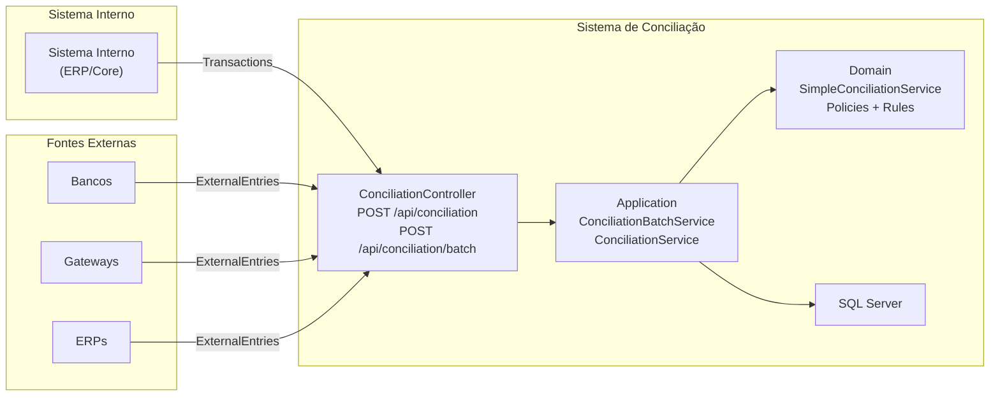

---

### 2. Fluxo de Dados de Alto Nível

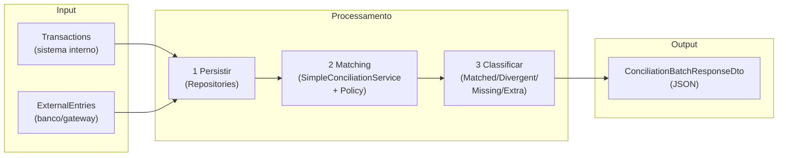

---

### 3. Arquitetura de Containers (System Design - Nível 2)

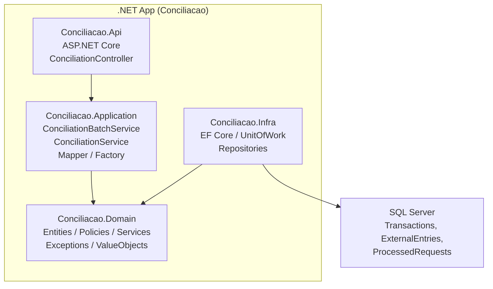

---

### 4. Dois Fluxos Principais (High-Level)

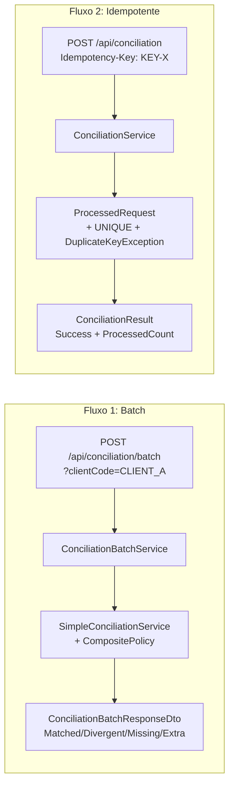

---

##  Diagramas Técnicos Detalhados

### 5. Visão Geral das Camadas

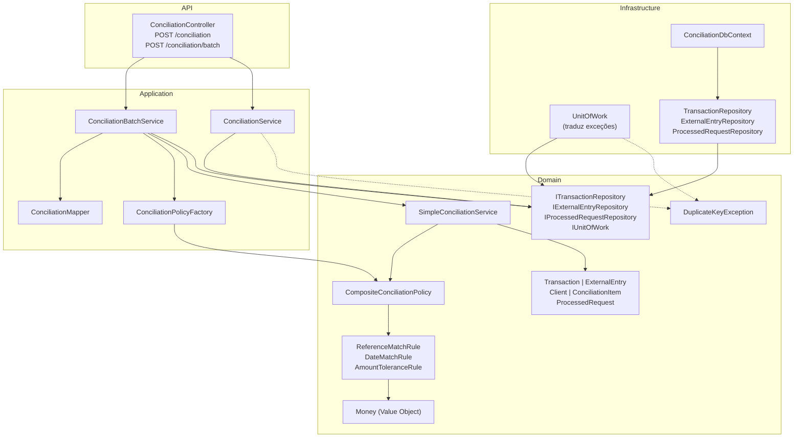

---

### 6. Fluxo Batch (Da requisição à resposta)

```mermaid
sequenceDiagram
    participant U as Usuário
    participant C as ConciliationController
    participant S as ConciliationBatchService
    participant M as ConciliationMapper
    participant TR as TransactionRepository
    participant ER as ExternalEntryRepository
    participant F as ConciliationPolicyFactory
    participant RS as SimpleConciliationService
    participant UoW as UnitOfWork

    U->>C: POST /api/conciliation/batch?clientCode=CLIENT_A
    C->>C: new Client(clientCode)
    C->>S: ConciliateBatchAsync(client, txDtos, entryDtos)

    rect rgb(230, 240, 255)
        Note over S,M: 1. Mapeamento DTO  Entity
        S->>M: ToEntity(transactionDtos)
        S->>M: ToEntity(externalEntryDtos)
    end

    rect rgb(230, 255, 230)
        Note over S,ER: 2. Persistência
        S->>TR: AddRangeAsync(transactions)
        S->>ER: AddRangeAsync(externalEntries)
    end

    rect rgb(255, 245, 230)
        Note over S,RS: 3. Matching
        S->>F: CreateFor(client)
        F-->>S: CompositePolicy(rules)
        S->>RS: new SimpleConciliationService(policy)
        S->>RS: Conciliate(transactions, externalEntries)
        RS-->>S: List<ConciliationItem>
    end

    rect rgb(240, 230, 255)
        Note over S,M: 4. Mapeamento Entity  DTO
        S->>M: ToDto(Matched/Divergent/Missing/Extra)
    end

    rect rgb(255, 230, 230)
        Note over S,UoW: 5. Commit atômico
        S->>UoW: CommitAsync()
    end

    S-->>C: ConciliationBatchResponseDto
    C-->>U: 200 OK + JSON
```

---

### 7. Fluxo Idempotente

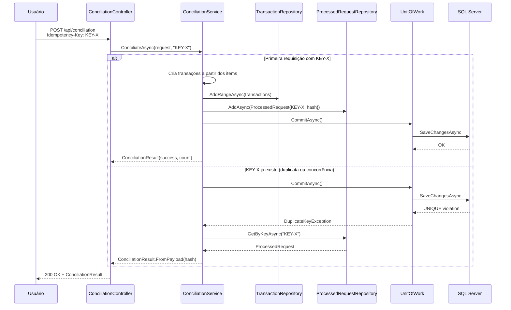

---

### 8. Políticas de Conciliação (Strategy + Composite)

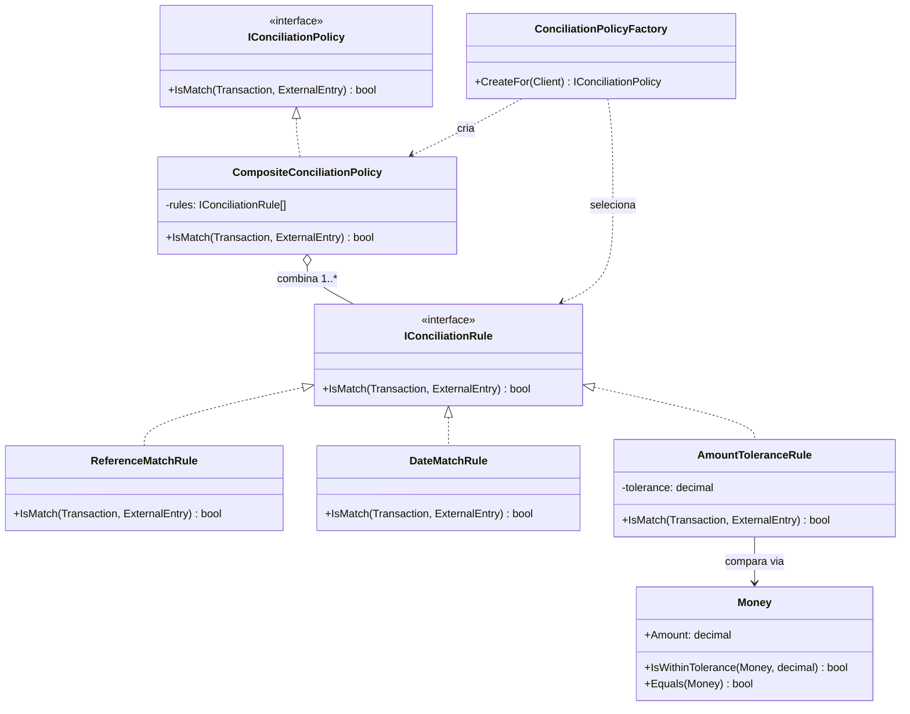

---

### 9. Configuração por Cliente

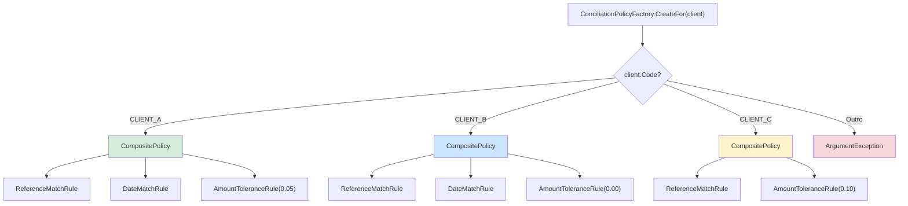

---

### 10. Entidades do Domínio

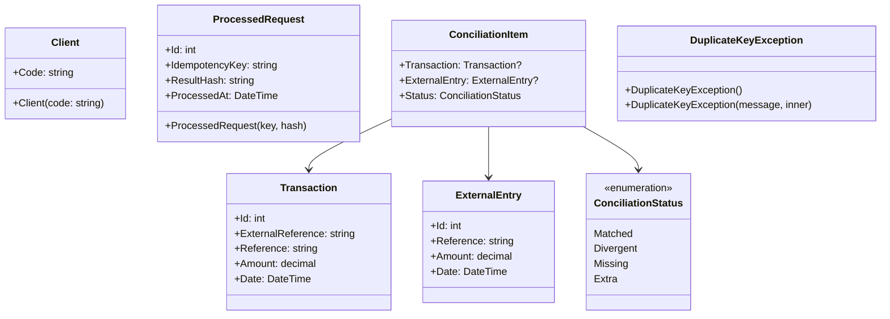

---

### 11. Consistência: Unit of Work

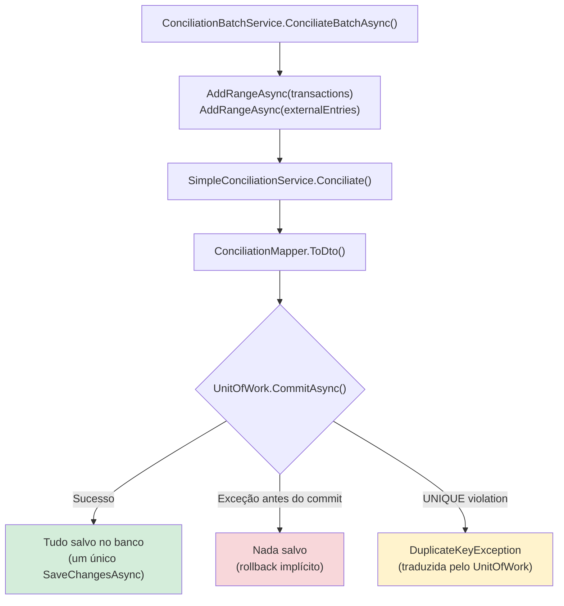

---

### 12. Concorrência na Idempotência

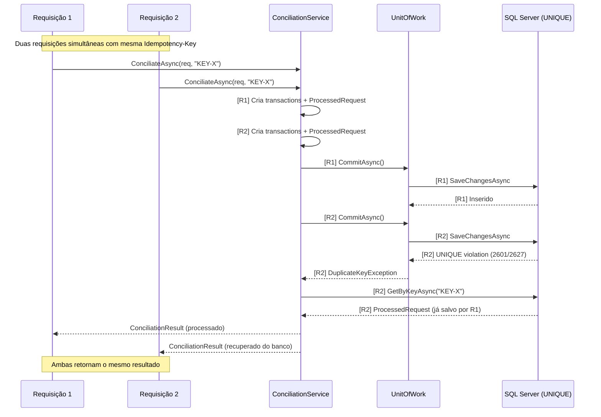

---

> **Nota:** Todos os diagramas usam nomes que correspondem exatamente às classes no código-fonte atual. `CompositeConciliationPolicy` é a única implementação de política (`IConciliationPolicy`). A tradução de exceções SQL  `DuplicateKeyException` é feita pelo `UnitOfWork` na infraestrutura.