# Diagramas do Sistema de Conciliação Financeira

> Todos os diagramas do projeto em Mermaid. Renderizam automaticamente no GitHub e GitLab.
> Também podem ser copiados para o [Mermaid Live Editor](https://mermaid.live).

---

## Diagrama 1 — Contexto Geral (System Design - Nivel 1)

Visão externa do sistema. Mostra quem interage com ele e de que forma.

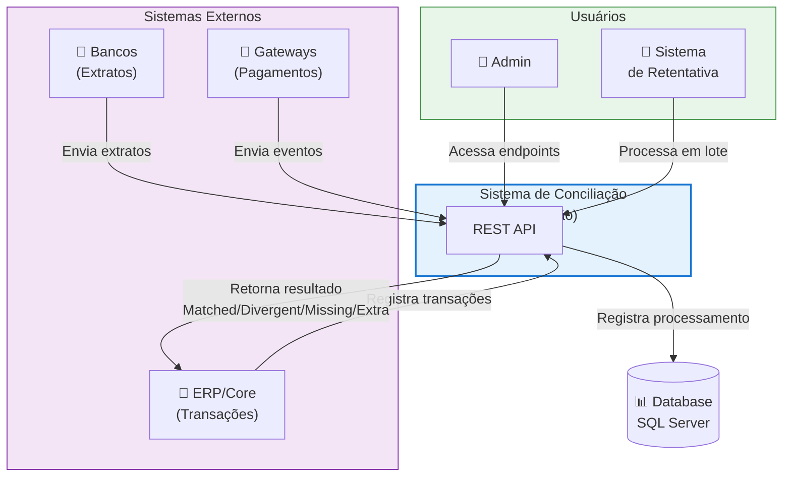

---

## Diagrama 2 — Fluxo de Dados de Alto Nível

Mostra como os dados fluem pela aplicação: entrada → processamento → saída.

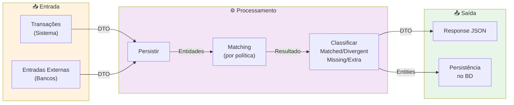

---

## Diagrama 3 — Arquitetura de Containers (System Design - Nivel 2)

Mostra os principais "containers" (componentes deployáveis) do sistema.

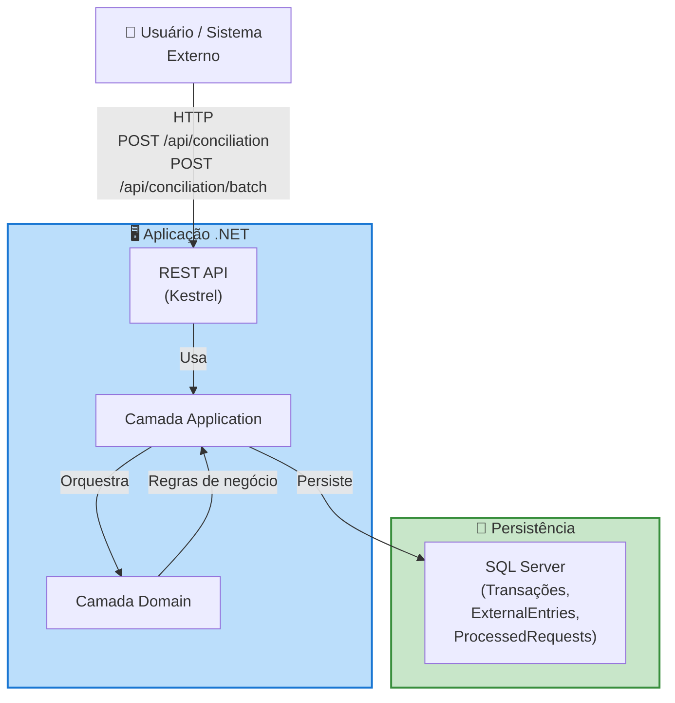

---

## Diagrama 4 — Dois Fluxos Principais (High-Level)

Visão dos dois caminhos principais da API em paralelo.

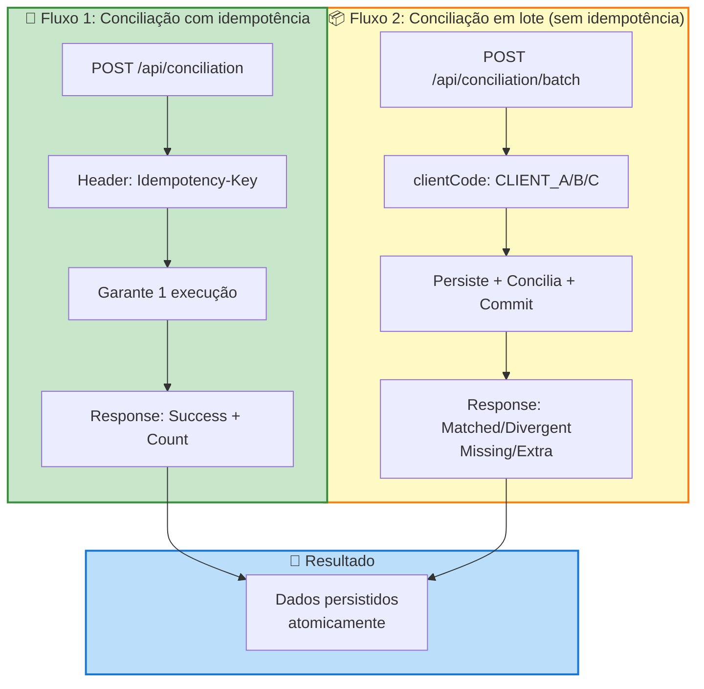

---

## Diagrama 5 — Visão Geral das Camadas

Mostra como o projeto está organizado em 4 camadas (Clean Architecture).

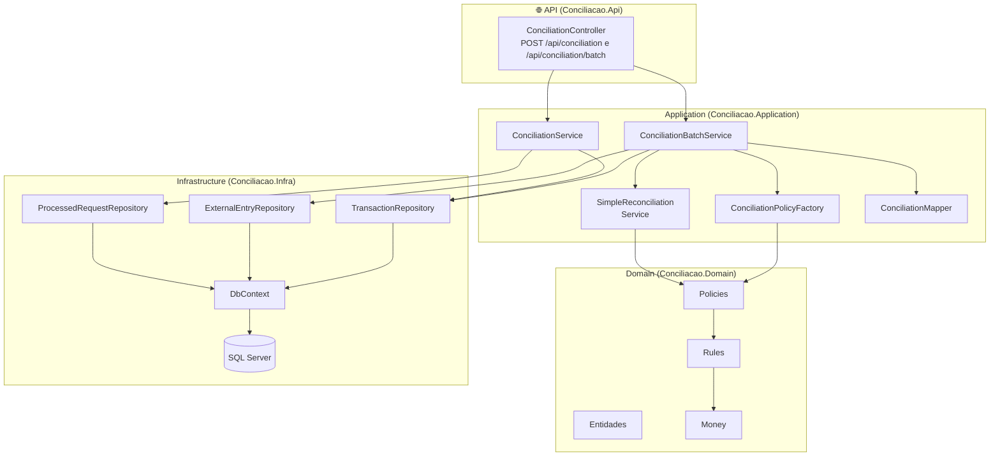

---

## Diagrama 6 — Fluxo Batch (Da requisição à resposta)

Mostra passo a passo o que acontece quando alguém chama `POST /api/conciliation/batch?clientCode=CLIENT_A`.

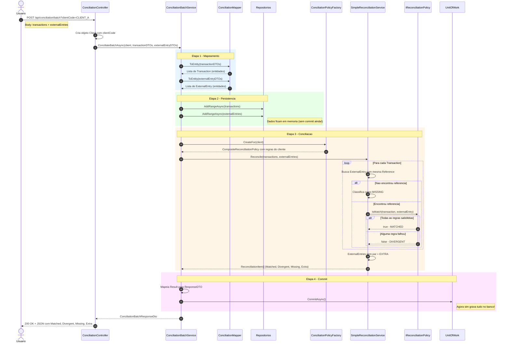

---

## Diagrama 7 — Fluxo Idempotente

Mostra como funciona o `POST /api/conciliation` com `Idempotency-Key`.

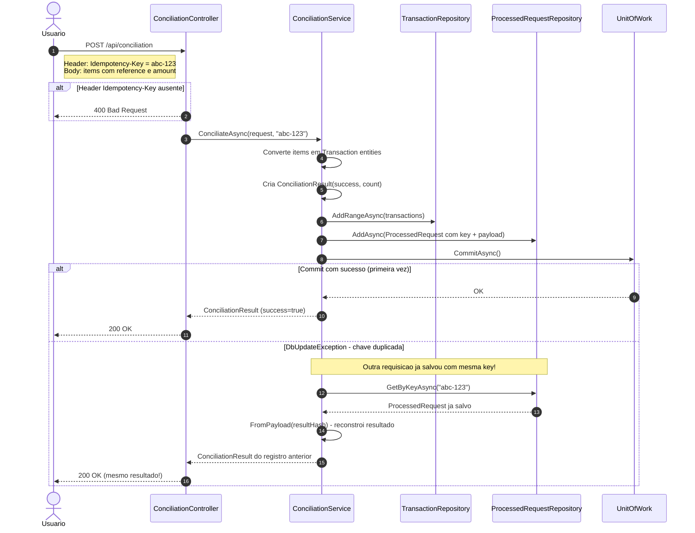

---

## Diagrama 8 — Políticas de Conciliação (Strategy + Composite)

Mostra como as regras de matching são organizadas.

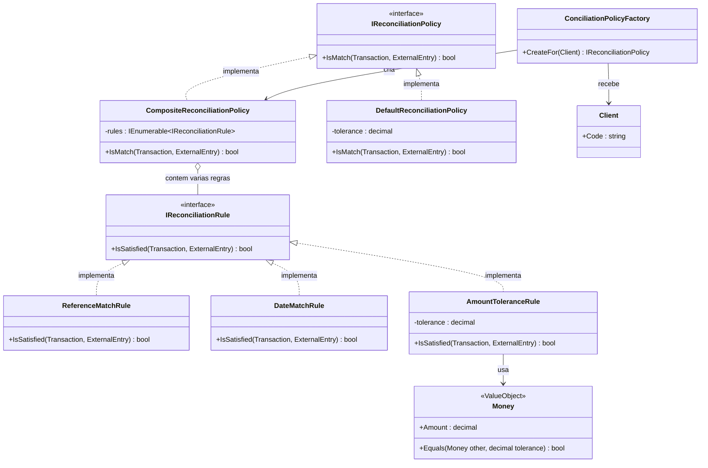

---

## Diagrama 9 — Configuração por Cliente

Mostra quais regras cada cliente usa.

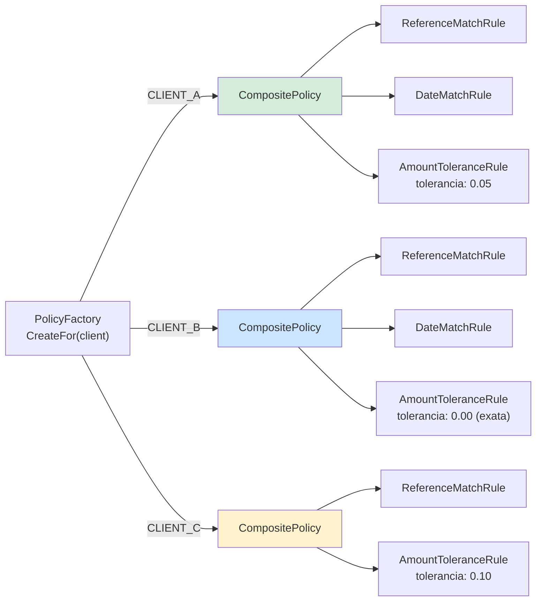

---

## Diagrama 10 — Entidades do Domínio

Mostra as principais entidades e seus atributos.

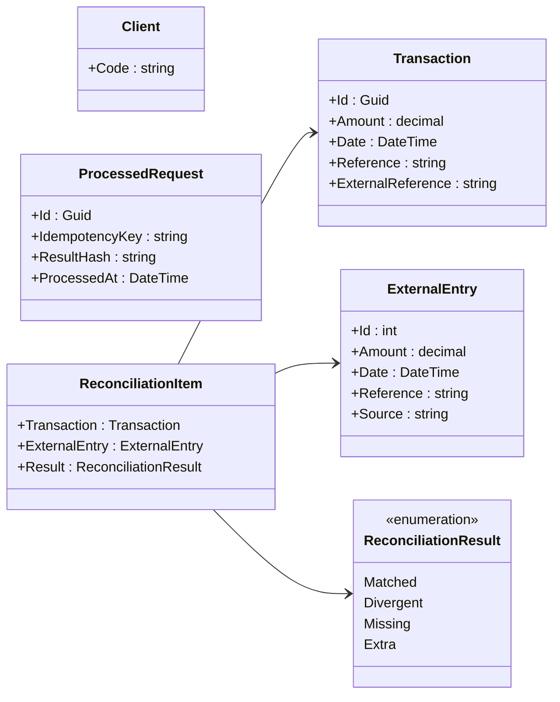

---

## Diagrama 11 — Consistência: Unit of Work

Mostra como o commit único garante atomicidade.

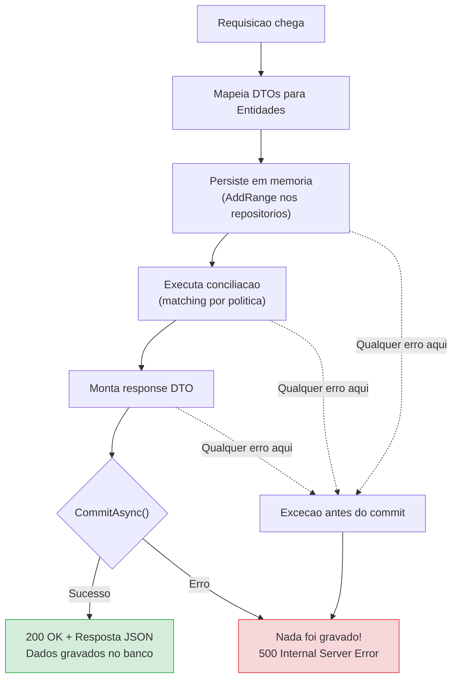

---

## Diagrama 12 — Concorrência na Idempotência

Mostra o que acontece quando duas requisições idênticas chegam ao mesmo tempo.

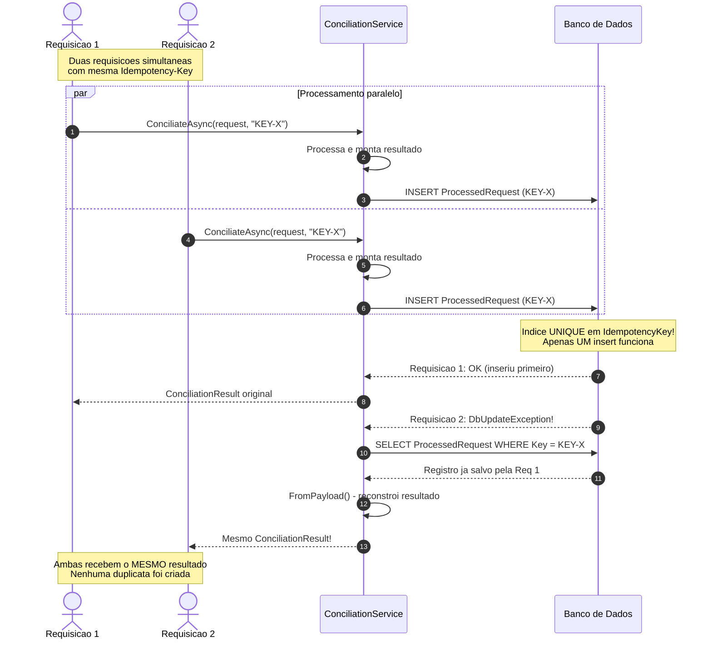
